# DeepAssetLens 用户手册

> DeepAssetLens（资产深度探查平台）是面向电力行业的数据资产知识图谱问答平台。
> 本手册覆盖系统全部功能模块的操作说明、截图演示与测试用例。

---

## 目录

1. [系统简介](#1-系统简介)
2. [登录与界面导航](#2-登录与界面导航)
3. [功能总览](#3-功能总览)
4. [数据资产探查（智能问答）](#4-数据资产探查智能问答)
5. [图谱建模](#5-图谱建模)
6. [数据资产](#6-数据资产)
7. [语义指标](#7-语义指标)
8. [能力管理](#8-能力管理)
9. [系统配置](#9-系统配置)
10. [测试用例汇总](#10-测试用例汇总)
11. [常见问题](#11-常见问题)
12. [术语表](#12-术语表)

---

## 1. 系统简介

DeepAssetLens 将企业数据资产组织为**知识图谱**（L1 业务域 → L2 主数据分类 → 实体 → 字段 → 关系），用户用自然语言提问，平台自动路由到对应技能（SQL 查询 / 概念解释 / 图谱浏览 / 血缘追溯），通过 Doris 联邦查询 / Neo4j 图查询 / ES 检索取数并生成结构化回答。

### 核心能力

| 能力 | 说明 |
|------|------|
| 智能问答 | ChatGPT 式对话界面，自动识别意图、路由技能、拼装 SQL、取数作答 |
| 知识图谱建模 | 四区建模（业务域 / 主数据 / 业务活动 / 字段），可视化图谱管理 |
| 数据资产矩阵 | 主数据实体 + 业务活动 + 来源表 + 映射配置一体化管理 |
| 向量检索 | 实体/属性向量库 + 自定义知识库（RAG），支持模糊召回 |
| 多源联邦查询 | Doris catalog 跨 MySQL / PostgreSQL / ES 联邦取数 |
| 技能管理 | 可编排的问答技能（locate / explore / sql-exec / trace-lineage 等） |

### 访问地址

- 前端：http://localhost:23000
- 后端 API 文档：http://localhost:28000/docs
- Neo4j Browser：http://localhost:7474

---

## 2. 登录与界面导航

### 2.1 访问系统

浏览器打开 http://localhost:23000 ，默认进入「数据资产探查」首页。

> 默认未启用权限认证（`ENABLE_AUTH=false`），所有请求按匿名 admin 处理，右上角用户徽标显示 `anonymous / admin / 权限关闭`。启用 Authentik 认证后需登录。

### 2.2 界面布局

系统采用「左侧菜单 + 顶部页签 + 主内容区」三栏布局：

- **顶部 Header**：全局搜索（输入关键字快速跳转页面）、用户徽标
- **左侧 Sider**：首页入口 + 5 个分组菜单（手风琴展开）+ 最近会话列表
- **主内容区**：多页签（最多 12 个），「首页」页签固定不可关闭

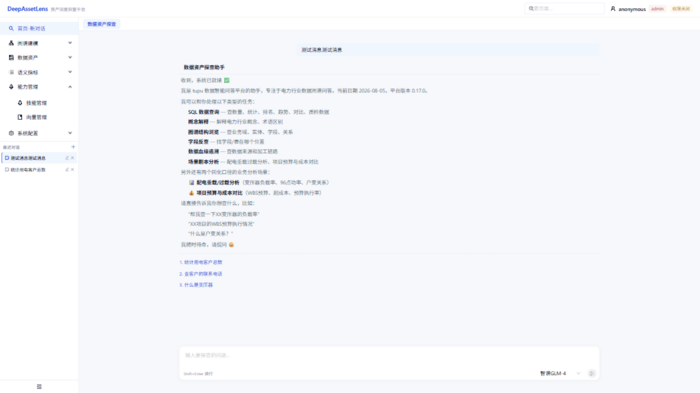

### 2.3 导航菜单结构

| 分组 | 菜单项 | 路由 |
|------|--------|------|
| 首页 | 首页-新对话 | `/home` |
| 图谱建模 | 图谱管理 | `/graph` |
| | 四区建模 | `/tree-model` |
| | 资产矩阵 | `/matrix` |
| | 实体关系 | `/entity-relation` |
| 数据资产 | 主数据 | `/master-data` |
| | 活动数据 | `/activity` |
| | 来源表管理 | `/source` |
| | 映射管理 | `/mapping` |
| | 数据源 | `/datasource` |
| 语义指标 | 指标管理 | `/metrics` |
| 能力管理 | 技能管理 | `/skills` |
| | 向量管理 | `/vector` |
| 系统配置 | Doris 配置 | `/doris-config` |
| | LLM 配置 | `/llm-config` |

---

## 3. 功能总览

系统按六大版块组织：

| 版块 | 功能 | 截图 |
|------|------|------|
| A. 数据资产探查 | 智能问答对话 | [home.png](docs/screenshots/home.png) |
| B. 图谱建模 | 图谱管理 / 四区建模 / 资产矩阵 / 实体关系 | graph / tree-model / matrix / entity-relation |
| C. 数据资产 | 主数据 / 活动数据 / 来源表管理 / 映射管理 / 数据源 | master-data / activity / source / mapping / datasource |
| D. 语义指标 | 指标管理 | metrics |
| E. 能力管理 | 技能管理 / 向量管理 | skills / vector |
| F. 系统配置 | Doris 配置 / LLM 配置 | doris-config / llm-config |

---

## 4. 数据资产探查（智能问答）

### 4.1 功能说明

首页是 ChatGPT 式居中对话界面，用户输入自然语言问题，系统通过 SSE 流式返回结果。问答引擎内部是一个 8 任务节点状态机：实体定位 → 属性定位 → SQL 拼装 → SQL 执行 → 结果组织 → 回答生成。

### 4.2 操作步骤

1. 在底部输入框输入问题（如「统计用电客户总数」）
2. 按 Enter 发送（Shift+Enter 换行）
3. 右侧可选择 LLM 模型（如智谱GLM-4）
4. 系统流式返回回答，过程中显示任务节点状态
5. 回答下方会推荐「下一步操作」可点击继续

### 4.3 支持的问答类型

- **SQL 数据查询**：查数量、统计、排名、趋势、对比、质检数据
- **概念解释**：解释电力行业概念、术语区别（如「什么是变压器」）
- **图谱结构浏览**：查业务域、实体、字段、关系
- **字段反查**：找字段/表在哪个位置
- **数据血缘追溯**：查数据来源和加工链路
- **场景剧本分析**：配电重载过载分析、项目预算与成本对比

### 4.4 截图


### 4.5 测试用例

| 编号 | 场景 | 操作步骤 | 预期结果 |
|------|------|---------|---------|
| TC-4.1 | 统计查询 | 输入「统计用电客户总数」→ Enter | 流式返回客户总数，含 SQL 与结果 |
| TC-4.2 | 概念解释 | 输入「什么是变压器」→ Enter | 返回变压器概念解释文本 |
| TC-4.3 | 会话管理 | 点击左侧「最近对话」切换历史会话 | 加载对应历史消息 |
| TC-4.4 | 推荐操作 | 完成一次问答后点击推荐按钮 | 发起对应新问题 |

> 前置条件：LLM 配置至少一个可用连接（见 §9.2）。

---

## 5. 图谱建模

### 5.1 图谱管理（/graph）

#### 功能说明

图谱画布统一外壳，顶部工具栏可切换 5 种画布模式：力导向、树形、四区、矩阵、Neo4j。支持聚焦实体 Tab 切换，展示全景图谱或单个实体的子图。

#### 操作步骤

1. 左侧菜单 → 图谱建模 → 图谱管理
2. 顶部 Segmented 切换画布模式（力导向 / 树形 / 四区 / 矩阵 / Neo4j）
3. 点击实体节点查看详情
4. 顶部「聚焦实体」Tab 可锁定单个实体的子图视图

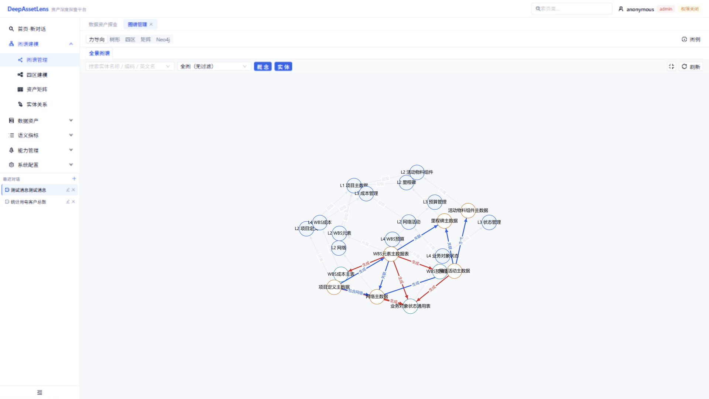

#### 测试用例

| 编号 | 场景 | 操作步骤 | 预期结果 |
|------|------|---------|---------|
| TC-5.1 | 切换画布 | 进入图谱管理 → 点击「树形」模式 | 画布切换为树形布局 |
| TC-5.2 | 查看节点 | 点击任一实体节点 | 显示节点详情面板 |
| TC-5.3 | Neo4j 模式 | 切换到「Neo4j」模式 | 显示 Neo4j 实时图数据 |

### 5.2 四区建模（/tree-model）

#### 功能说明

四区建模画布，以四象限组织业务域、主数据、业务活动、字段，展示分层结构关系。

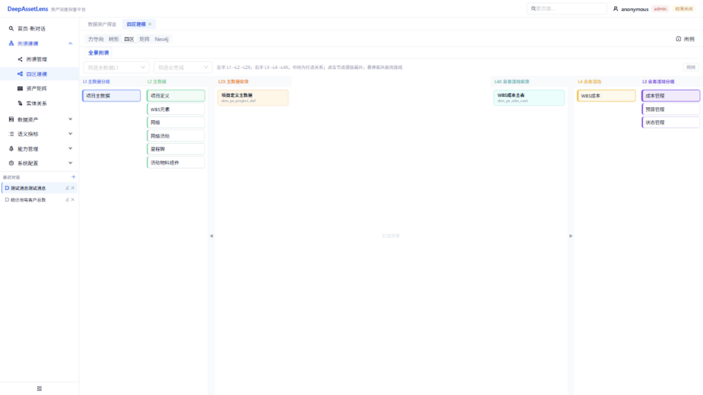

#### 测试用例

| 编号 | 场景 | 操作步骤 | 预期结果 |
|------|------|---------|---------|
| TC-5.4 | 四区加载 | 进入四区建模 | 四象限画布正常渲染节点 |

### 5.3 资产矩阵（/matrix）

#### 功能说明

资产矩阵画布，以矩阵形式展示主数据实体与业务活动的交叉关系。

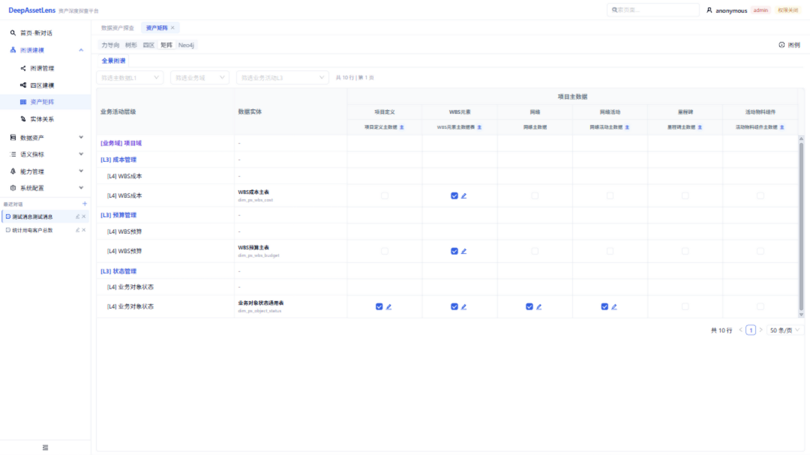

#### 测试用例

| 编号 | 场景 | 操作步骤 | 预期结果 |
|------|------|---------|---------|
| TC-5.5 | 矩阵加载 | 进入资产矩阵 | 矩阵画布正常渲染 |

### 5.4 实体关系（/entity-relation）

#### 功能说明

实体关系管理页面，支持实体关系的增删改查、详情抽屉、Excel 批量导入导出。

#### 操作步骤

1. 左侧菜单 → 图谱建模 → 实体关系
2. 列表展示所有实体关系，可搜索筛选
3. 点击「新增」创建关系，或点击行打开详情抽屉编辑
4. 点击「导出 Excel」下载，或「导入 Excel」批量上传

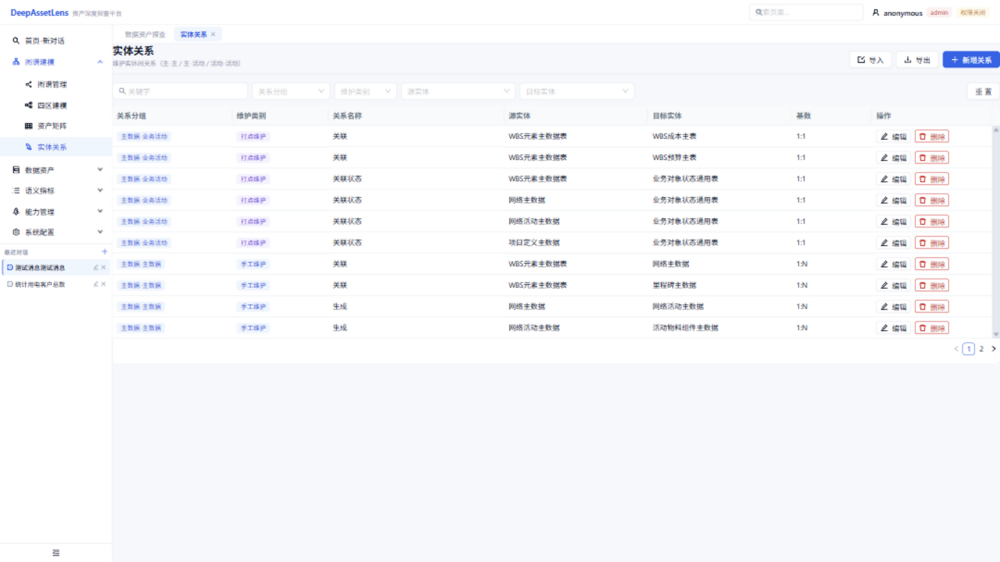

#### 测试用例

| 编号 | 场景 | 操作步骤 | 预期结果 |
|------|------|---------|---------|
| TC-5.6 | 查看关系列表 | 进入实体关系 | 列表显示关系记录 |
| TC-5.7 | 导出 Excel | 点击「导出」 | 下载 Excel 文件 |
| TC-5.8 | 查看详情 | 点击某行记录 | 右侧抽屉显示详情 |

---

## 6. 数据资产

### 6.1 主数据（/master-data）

#### 功能说明

主数据建模，左侧概念分类树（L1 业务域 → L2 主数据分类），右侧 L2 主数据实体列表。支持实体的增删改查。

#### 操作步骤

1. 左侧菜单 → 数据资产 → 主数据
2. 左侧树点击分类节点，右侧加载该分类下的实体
3. 点击实体可编辑属性

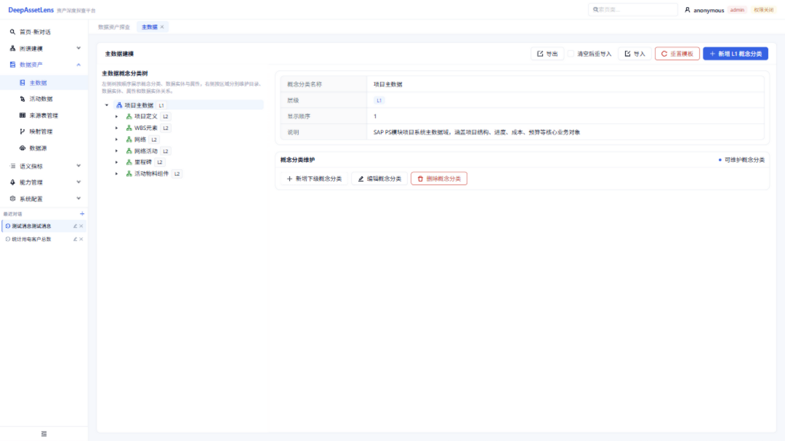

#### 测试用例

| 编号 | 场景 | 操作步骤 | 预期结果 |
|------|------|---------|---------|
| TC-6.1 | 浏览分类树 | 进入主数据 | 左侧树展示业务域与分类 |
| TC-6.2 | 查看实体 | 点击分类节点 | 右侧列出该分类的实体 |

### 6.2 活动数据（/activity）

#### 功能说明

业务活动建模，结构与主数据类似，左侧业务活动建模树，右侧 L4 业务活动实体列表。

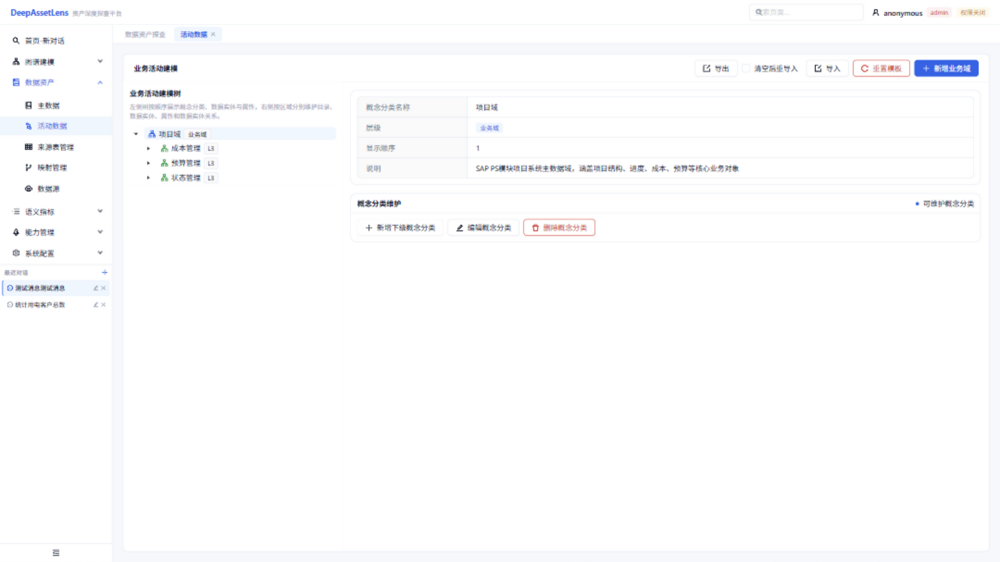

#### 测试用例

| 编号 | 场景 | 操作步骤 | 预期结果 |
|------|------|---------|---------|
| TC-6.3 | 浏览活动树 | 进入活动数据 | 左侧树展示业务活动结构 |

### 6.3 来源表管理（/source）

#### 功能说明

来源表管理是数据资产的核心模块，包含 5 个 Tab：

| Tab | 说明 |
|-----|------|
| 来源表管理-主数据 | 主数据来源表注册（L2 实体对应的物理表） |
| 来源表管理-业务 | 业务来源表注册（L4 活动对应的物理表） |
| 来源表管理-参考 | 参考来源表（字典/维度表） |
| 来源字段目录 | 来源表的字段目录（字段级元数据） |
| 表间关联关系管理 | L2 对象关系、L4 活动关系、L4-L2 主表关系 |

支持树形导航 + Excel 导入导出模板。

#### 操作步骤

1. 左侧菜单 → 数据资产 → 来源表管理
2. 顶部切换 Tab（主数据 / 业务 / 参考 / 字段目录 / 关联关系）
3. 每个 Tab 下可新增、编辑、导入、导出

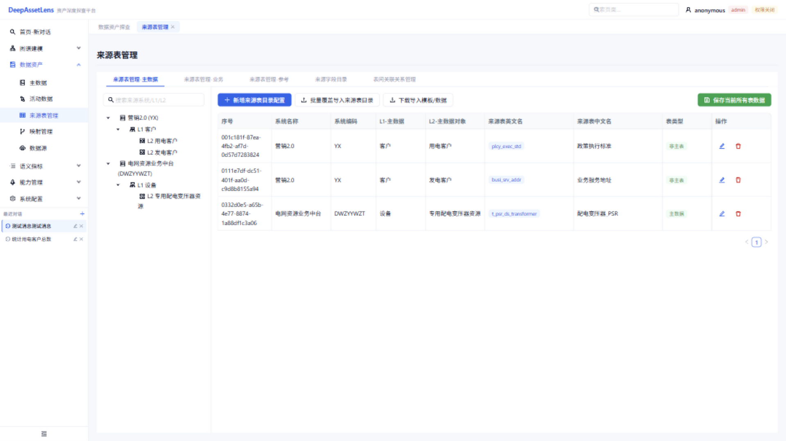

#### 测试用例

| 编号 | 场景 | 操作步骤 | 预期结果 |
|------|------|---------|---------|
| TC-6.4 | 切换 Tab | 点击「来源字段目录」Tab | 切换到字段目录表格 |
| TC-6.5 | 查看主数据来源表 | 默认 Tab 查看列表 | 显示主数据来源表记录（中文正常） |
| TC-6.6 | 导出模板 | 点击「导出」 | 下载 Excel 模板 |

> 验证要点：来源表数据应显示中文（如「营销2.0」「用电客户」「政策执行标准」），若显示问号则为数据库编码问题，见部署手册 §13.2。

### 6.4 映射管理（/mapping）

#### 6.4.1 功能概述：业务对象的三种来源

映射管理是 DeepAssetLens「本体对象虚拟化连接」的核心，解决"知识图谱里的实体，数据到底从哪来、怎么取"的问题。每个实体（业务对象）通过 `source_mode` 字段指定取数方式，对应三种来源：

| source_mode | 来源类型 | 取数引擎 | 跨源/跨API能力 |
|-------------|---------|---------|---------------|
| `physical_table` | 落地实体表映射 | PostgreSQL 直查 | 不跨源（已落库） |
| `sql_integration` | 虚拟SQL映射 | **Doris 联邦** | **跨源计算**（跨 catalog JOIN） |
| `api_integration` | 多源API映射 | **DuckDB 内存联邦** | **跨API计算**（多 API 联邦 JOIN） |

映射管理页面提供 3 个 Tab 分别配置这三种来源。统一的取数入口是后端 `/entity-preview/{entity_id}` 和 `/entity-data/{entity_code}`，后端按 `source_mode` 自动分发到对应引擎。

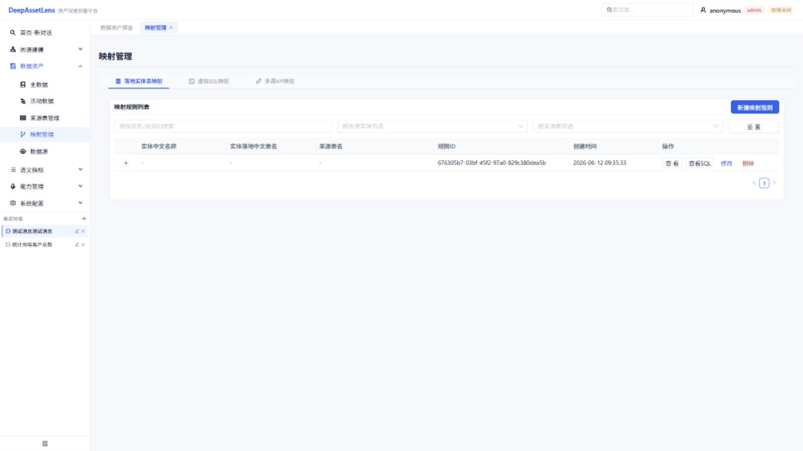

#### 6.4.2 落地实体表映射（physical_table）

**适用场景**：主数据/业务表已物理落库到 PostgreSQL，做字段级血缘治理与映射文档化。本身不跨源执行取数，预览时直连 PG 查 `entity_en_name` 对应的表。

**界面**：映射规则列表（实体中文名称、实体落地中文表名、来源表名、规则ID、创建时间、操作），支持新建/查看/查看SQL/修改/删除，可按规则名、图谱实体、来源表筛选。

**操作步骤**：
1. 左侧菜单 -> 数据资产 -> 映射管理 -> 「落地实体表映射」Tab
2. 点击「新建映射规则」
3. 选择目标实体（强制只能一个）+ 来源表（树形多选，分主数据/业务/参考三类）
4. 配置字段映射：每个属性点「选择来源字段(多选)」，可勾选主键、设主表、写「提取逻辑」说明
5. 辅助操作：「智能自动匹配」（按名称模糊匹配自动填映射）、「生成SQL」（拼 SELECT+LEFT JOIN 模板）、「导入映射」(CSV)、「导出模板」
6. 保存

> 这是字段级映射文档，记录实体每个属性来自哪张来源表哪个字段，偏元数据治理/溯源。

#### 6.4.3 虚拟SQL映射（sql_integration）—— 跨源计算

**适用场景**：数据分布在多个库（MySQL/PostgreSQL/Oracle 等），需要跨库 JOIN 出一个对象视图。数据已在 Doris 体系内，或可为各数据源建 jdbc catalog。

**跨源计算原理**：

```
┌─────────────────────────────────────────────┐
│  虚拟SQL映射：integration_sql               │
│  SELECT a.x, b.y                            │
│  FROM pg_tupu.public.dim_ps_wbs_cost a      │  <- 3段命名: catalog.db.table
│  LEFT JOIN es_tupu.default_db.tupu_xxx b    │  <- 跨 catalog JOIN
│    ON a.id = b.id                           │
└──────────────────┬──────────────────────────┘
                   │ pymysql -> localhost:9030
                   ▼
            ┌────────────┐
            │   Doris    │  联邦查询引擎
            └─────┬──────┘
         ┌────────┼────────┐
         ▼        ▼        ▼
     ┌──────┐ ┌──────┐ ┌──────┐
     │ PG   │ │ ES   │ │MySQL │  ...各数据源 catalog
     └──────┘ └──────┘ └──────┘
```

SQL 用 **3 段命名 `catalog.db.table`**，由 Doris 自身做跨 catalog JOIN。`doris_catalog` 字段存到实体上，执行时 `SWITCH` 到该 catalog。filters 通过 sqlglot 解析，把 WHERE 条件下推到 Doris。

**界面**：左侧对象列表（仅 `source_mode=sql_integration` 的实体，带搜索）+ 右侧 Monaco SQL 编辑器 + 验证结果表。

**操作步骤**：
1. 「虚拟SQL映射」Tab -> 左侧选择对象（或新建）
2. 在 Monaco 编辑器填写 `integration_sql`（建议不含 WHERE，3 段命名）
3. 选择 `doris_catalog`（存到实体字段）
4. 点击「保存」更新实体
5. 点击「验证执行」—— 后端 `POST /integration-sql/verify` 执行 SQL（限 100 行返回），结果显示在右侧表
6. （可选）点击「AI 校验改写」—— 后端 `POST /integration-sql/ai-rewrite`：执行 `LIMIT 0` 取 SQL 输出列，与实体 `properties_schema` 比对，列名/类型不匹配时 LLM 自动改写（加 `AS` 别名 / `CAST`），弹窗对比可一键应用

> LLM 智能问答取数时，调用 `POST /integration-sql/execute`（带 filters）执行该 SQL。

#### 6.4.4 多源API映射（api_integration）—— 跨API计算

**适用场景**：数据只能通过 API 取（如 Elasticsearch `_search`、外部 REST 服务），需要把多个 API 的数据联邦整合成一个对象。

**跨API计算原理**：

```
┌───────────────────────────────────────────────┐
│  对象API映射：pseudo_sql（伪逻辑SQL）          │
│  SELECT a.col, b.col                          │
│  FROM dim_ps_xxx a   <- API端点1 虚拟表名      │
│  LEFT JOIN dim_ps_yyy b  <- API端点2 虚拟表名  │
│    ON a.id = b.id                             │
└───────────────────┬───────────────────────────┘
                    │ sqlglot 解析 + 下推参数
        ┌───────────┴───────────┐
        ▼                       ▼
   ┌─────────┐             ┌─────────┐
   │ API端点1 │             │ API端点2 │  各自 HTTP 调用
   └────┬────┘             └────┬────┘
        │ DataFrame              │ DataFrame
        ▼                        ▼
   ┌─────────────────────────────────┐
   │  DuckDB 内存库                   │
   │  register(虚拟表名, DataFrame)   │
   │  执行 pseudo_sql 联邦 JOIN/聚合   │
   └─────────────────────────────────┘
```

每个 API 端点定义一个「虚拟表名」（`table_name`），pseudo_sql 引用这些虚拟表名做 JOIN。执行时：sqlglot 解析 SQL 提取表名 + WHERE 常量 + JOIN 等值条件 -> 推导下推参数 -> 对每个表调 API -> DataFrame -> DuckDB register 临时表 -> 执行原 SQL 内存 JOIN。DuckDB 还可 ATTACH PostgreSQL/Doris 做更广联邦。

**界面**：内部再分两个子 Tab：
- **对象API映射**：左侧对象API映射列表 + 右侧表单（对象 + API端点(多选) + pseudo_sql + 描述）
- **远程调用API**：左侧端点列表（按 `table_name` 前缀分组）+ 右侧 SQL 模拟区

**操作步骤（配置一个 API 端点）**：
1. 「多源API映射」Tab -> 「远程调用API」子 Tab
2. 新增端点，填写：
   - `name` 中文名、`table_name` 虚拟表名（英文唯一，如 `dim_ps_project`）
   - `api_url`（如 ES `_search` 地址）、`method` GET/POST
   - `params` 过滤参数数组：`{name(API参数名), column(SQL列名/JOIN列), map_to(如 query)}`
   - `columns` 返回列数组：`{name(SQL列名), json_path(响应JSON字段,支持点号嵌套如 `_source.col`), type(DuckDB类型)}`
   - `data_path` 响应数据路径（如 `hits.hits` 或 `data.TABLES.XXX`）
3. 点击「测」—— 后端 `POST /api-endpoints/{id}/test` 单端点无参拉前 10 行验证

**操作步骤（配置对象API映射，实现跨API联邦）**：
1. 「多源API映射」Tab -> 「对象API映射」子 Tab
2. 新增映射，选择对象（实体）+ 多个 API 端点 + 填写 `pseudo_sql`（引用端点虚拟表名做 JOIN，不含 WHERE）+ 描述
3. 点击「验证SQL」—— 后端 `POST /entity-api-mappings/{id}/verify` 执行 pseudo_sql（无 filters），多 API 在 DuckDB 内存联邦 JOIN 返回结果
4. 保存

> LLM 智能问答取数时，调用 `POST /entity-api-mappings/execute`（带 filters）—— build_sql_with_filters 拼 WHERE 后 DuckDB 联邦执行。

#### 6.4.5 三种来源对比

| 维度 | 落地实体表映射 | 虚拟SQL映射（跨源） | 多源API映射（跨API） |
|------|--------------|-------------------|---------------------|
| source_mode | physical_table | sql_integration | api_integration |
| 执行引擎 | PostgreSQL 直查 | Doris 联邦 | DuckDB 内存库 |
| 跨源方式 | 不跨源 | Doris jdbc catalog 跨库 JOIN | 多 API 虚拟表内存 JOIN；可 ATTACH pg/doris |
| 配置粒度 | 实体属性 ↔ 来源表字段 | 整段 integration_sql + doris_catalog | 端点(meta) + 对象映射(pseudo_sql) |
| filters 下推 | 无 | sqlglot 别名映射拼 WHERE 下推 Doris | sqlglot 解析 WHERE+JOIN 推导下推到 API query |
| 数据源形态 | 已落库关系表 | Doris 可达的库/视图 | HTTP API（REST/ES _search） |
| AI 辅助 | 智能自动匹配 | AI 校验改写 SQL | 无 |
| 典型场景 | 字段血缘治理、映射文档化 | 跨库 JOIN 出对象视图 | 多 API 联邦整合 |

> 三者通过 `Entity.source_mode` 统一切换，在「主数据/活动数据」建模树里可改 source_mode 并跳到对应映射 Tab。

#### 测试用例

| 编号 | 场景 | 操作步骤 | 预期结果 |
|------|------|---------|---------|
| TC-6.7 | 查看映射规则 | 落地表映射 Tab 查看列表 | 显示映射规则记录 |
| TC-6.8 | 新建映射规则 | 新建 -> 选实体+来源表+字段映射 -> 保存 | 规则列表新增一条 |
| TC-6.9 | 跨源验证执行 | 虚拟SQL Tab -> 填 integration_sql -> 验证执行 | 返回跨源 JOIN 结果（限100行） |
| TC-6.10 | 跨源 AI 改写 | 虚拟SQL Tab -> AI 校验改写 | 弹窗显示列差异 + 改写后 SQL |
| TC-6.11 | 配置 API 端点 | 多源API Tab -> 远程调用API -> 新增端点 -> 测 | 返回端点前 10 行数据 |
| TC-6.12 | 跨API联邦验证 | 多源API Tab -> 对象API映射 -> 填 pseudo_sql -> 验证SQL | 多 API 在 DuckDB 联邦 JOIN 返回结果 |

### 6.5 数据源（/datasource）

#### 功能说明

数据源配置，管理数据库连接（DB 连接列表 CRUD + 连接测试）。字段包括 db_type、host、port、database、是否默认、是否启用、doris_catalog_name。

#### 操作步骤

1. 左侧菜单 → 数据资产 → 数据源
2. 点击「新增」填写数据库连接信息
3. 点击「测试连接」验证可用性
4. 标记「默认」「启用」

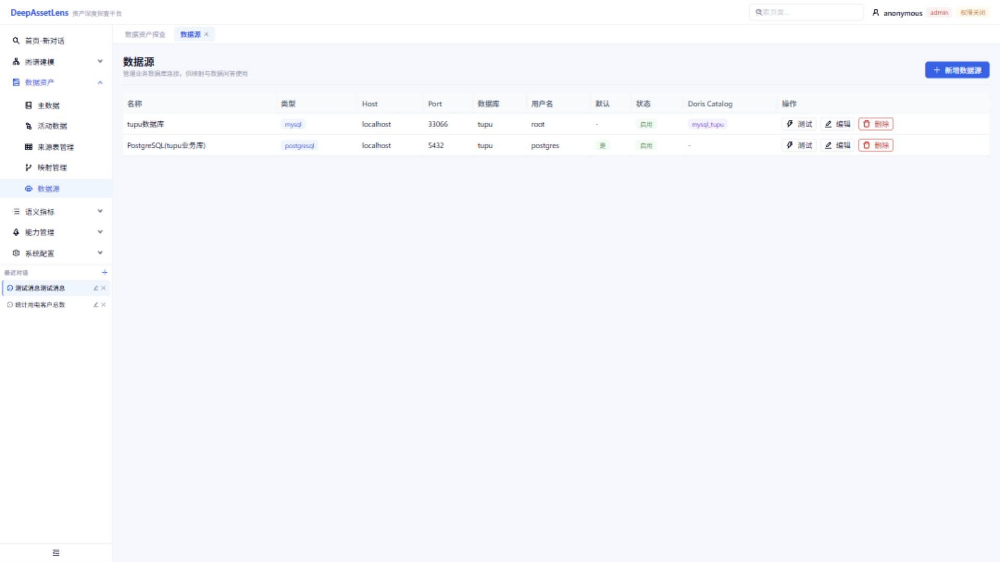

#### 测试用例

| 编号 | 场景 | 操作步骤 | 预期结果 |
|------|------|---------|---------|
| TC-6.9 | 查看数据源 | 进入数据源 | 列表显示已配置的数据源 |
| TC-6.10 | 测试连接 | 点击某数据源「测试」 | 返回连接成功/失败状态 |

---

## 7. 语义指标

### 7.1 指标管理（/metrics）

#### 功能说明

指标管理中心，功能丰富：

- **指标字典**：基础/业务/技术/管理属性、别名
- **原子指标**：原子指标定义、口径过滤、维度白名单、过滤白名单
- **派生配置**：拖拽式派生指标配置、依赖指标
- **血缘图**：指标血缘关系可视化
- **版本管理**：版本列表、变更记录
- **治理流转**：提交 / 审批 / 驳回 / 发布 / 回滚

#### 操作步骤

1. 左侧菜单 → 语义指标 → 指标管理
2. 左侧指标列表，点击指标查看详情
3. 详情区可编辑属性、配置原子/派生指标、查看血缘与版本
4. 顶部治理流转按钮：提交 → 审批 → 发布

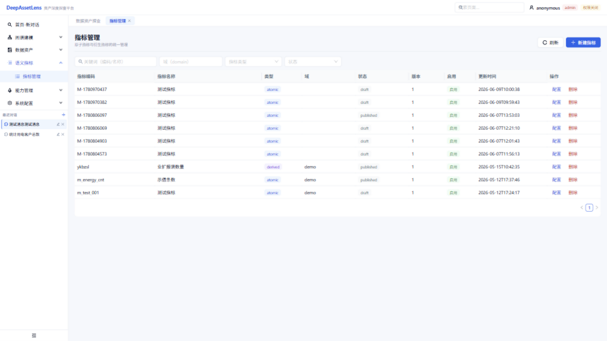

#### 测试用例

| 编号 | 场景 | 操作步骤 | 预期结果 |
|------|------|---------|---------|
| TC-7.1 | 浏览指标列表 | 进入指标管理 | 列表显示指标记录 |
| TC-7.2 | 查看指标详情 | 点击某指标 | 详情区显示属性、血缘、版本 |
| TC-7.3 | 查看血缘 | 详情区切换到「血缘图」 | 渲染指标血缘关系图 |

---

## 8. 能力管理

### 8.1 技能管理（/skills）

#### 功能说明

技能管理 V2，支持：

- 技能列表、创建 / 重命名 / 删除 / 发布 / 取消发布
- 技能类型多色标签
- Monaco 代码编辑器 + Markdown 预览
- 调试会话、模板、定时调度、密钥柜、Worker 管理

#### 操作步骤

1. 左侧菜单 → 能力管理 → 技能管理
2. 左侧技能列表，点击技能查看
3. 右侧 Monaco 编辑器编辑技能代码，支持 Markdown 预览
4. 顶部「发布」按钮发布技能

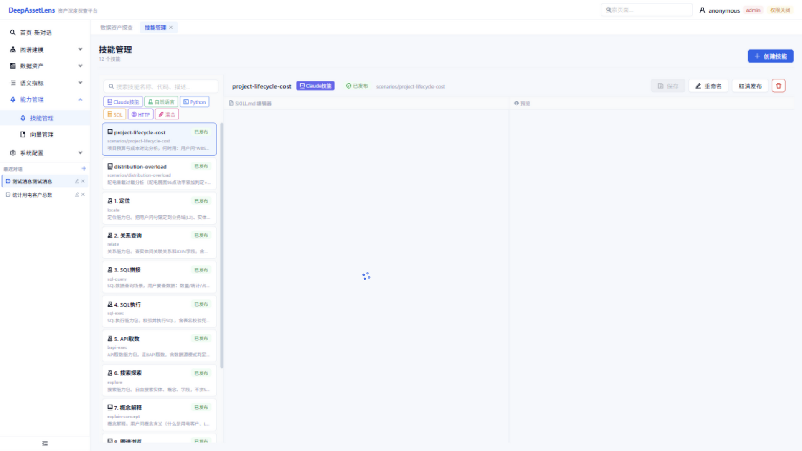

#### 测试用例

| 编号 | 场景 | 操作步骤 | 预期结果 |
|------|------|---------|---------|
| TC-8.1 | 浏览技能列表 | 进入技能管理 | 列表显示技能（多色类型标签） |
| TC-8.2 | 查看技能代码 | 点击某技能 | 右侧 Monaco 编辑器显示代码 |
| TC-8.3 | 切换预览 | 点击「Markdown 预览」 | 显示渲染后的 Markdown |

### 8.2 向量管理（/vector）

#### 功能说明

向量管理面板：

- **实体/属性双库向量同步**：向量化实体与属性
- **查询测试**：向量相似度检索测试
- **标准语义术语向量化**：将语义词库向量化
- **自定义知识库（RAG）**：上传文档 → 向量化 → 检索

#### 操作步骤

1. 左侧菜单 → 能力管理 → 向量管理
2. 「向量同步」Tab：查看实体/属性向量统计，触发同步
3. 「查询测试」Tab：输入查询，测试向量召回
4. 「知识库」Tab：上传文档、向量化、检索

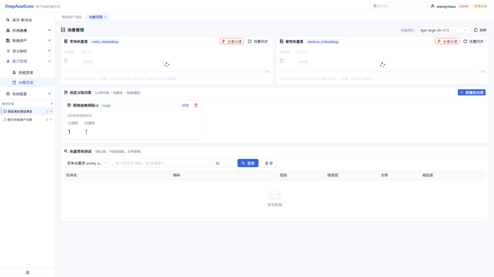

#### 测试用例

| 编号 | 场景 | 操作步骤 | 预期结果 |
|------|------|---------|---------|
| TC-8.4 | 查看向量统计 | 进入向量管理 | 显示实体/属性向量数量统计 |
| TC-8.5 | 查询测试 | 输入查询词 → 检索 | 返回相似度排序结果 |

> 前置条件：嵌入模型已下载（见部署手册 §7），否则向量化功能不可用。

---

## 9. 系统配置

### 9.1 Doris 配置（/doris-config）

#### 功能说明

Doris 连接配置与 Catalog 管理：

- Doris 连接配置（host/port/user/password）+ 测试连接
- Catalog 管理：jdbc 联邦 catalog 新增 / 删除（es_tupu、pg_tupu 等）

#### 操作步骤

1. 左侧菜单 → 系统配置 → Doris 配置
2. 填写 Doris 连接信息 → 「测试连接」
3. 「Catalog 管理」区域新增/删除联邦 catalog

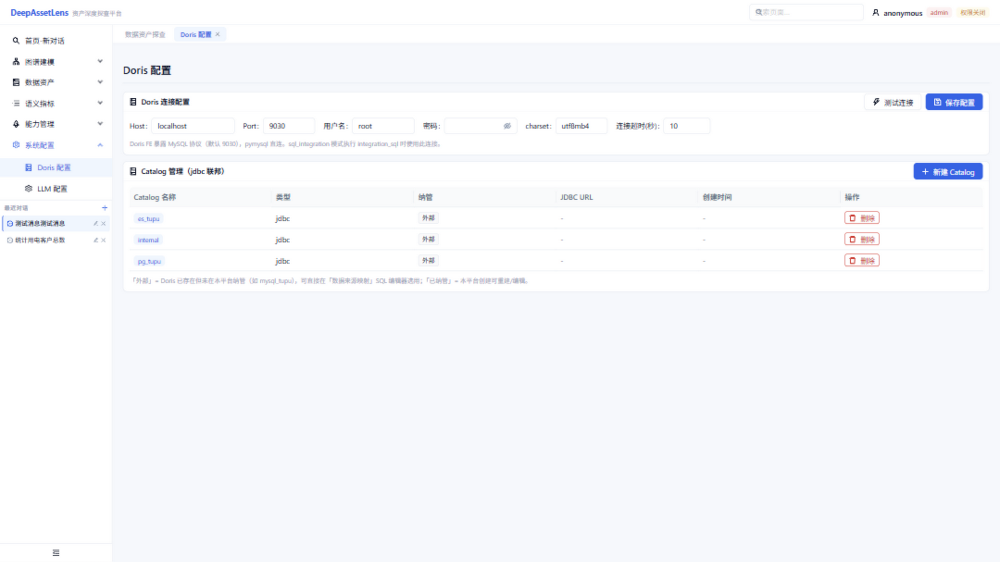

#### 测试用例

| 编号 | 场景 | 操作步骤 | 预期结果 |
|------|------|---------|---------|
| TC-9.1 | 测试 Doris 连接 | 填写连接信息 → 点击「测试」 | 返回连接成功 |
| TC-9.2 | 查看 Catalog | 进入 Doris 配置 | 列表显示已配置的 catalog |

### 9.2 LLM 配置（/llm-config）

#### 功能说明

LLM 大模型连接管理，是智能问答的前置依赖：

- LLM 连接 CRUD + 测试 + 对话
- 规划器配置（Planner Config）：快速响应 / 深度思考两种模式 + effort 等级

#### 操作步骤

1. 左侧菜单 → 系统配置 → LLM 配置
2. 点击「新增连接」，填写：
   - 连接名称（如「智谱GLM」）
   - 提供商：智谱 GLM / DeepSeek / 通义千问 / 豆包
   - API Key、模型名称（如 `glm-4`）
3. 点击「测试」确认连接
4. 在「规划器配置」设置默认 LLM 与思考模式

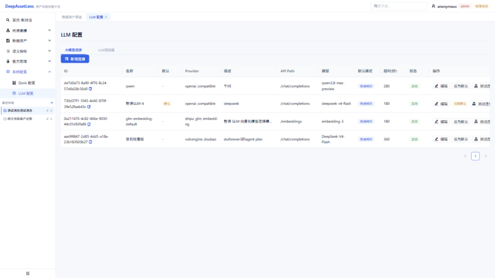

#### 测试用例

| 编号 | 场景 | 操作步骤 | 预期结果 |
|------|------|---------|---------|
| TC-9.3 | 新增 LLM 连接 | 填写 API Key → 保存 | 列表新增一条连接 |
| TC-9.4 | 测试连接 | 点击「测试」 | 返回连接成功 |
| TC-9.5 | 对话测试 | 点击「对话」输入消息 | LLM 流式返回回答 |
| TC-9.6 | 规划器配置 | 设置默认 LLM + 深度思考 | 保存成功 |

> 这是智能问答（§4）的前置条件，必须先配置至少一个可用 LLM 连接。

---

## 10. 测试用例汇总

以下是全系统测试用例汇总，可用于回归验证：

| 模块 | 用例数 | 编号范围 |
|------|--------|---------|
| 数据资产探查 | 4 | TC-4.1 ~ TC-4.4 |
| 图谱建模 | 8 | TC-5.1 ~ TC-5.8 |
| 数据资产 | 12 | TC-6.1 ~ TC-6.12 |
| 语义指标 | 3 | TC-7.1 ~ TC-7.3 |
| 能力管理 | 5 | TC-8.1 ~ TC-8.5 |
| 系统配置 | 6 | TC-9.1 ~ TC-9.6 |
| **合计** | **38** | |

### 测试前置条件

1. 后端 28000、前端 23000 均正常运行
2. 数据库已初始化（中文正常，非问号）
3. Neo4j 已同步图谱（25 节点 / 56 关系）
4. LLM 配置至少一个可用连接
5. 嵌入模型已下载（向量管理测试需要）

### 测试执行建议

- **冒烟测试**：TC-4.1（智能问答）、TC-5.1（图谱切换）、TC-6.4（来源表 Tab）、TC-9.4（LLM 测试）—— 验证核心链路
- **功能测试**：执行全部 36 个用例
- **回归测试**：每次部署后执行冒烟测试 4 项

---

## 11. 常见问题

### Q1：智能问答无响应 / 报错

**排查**：
1. 检查 LLM 配置（§9.2）是否至少一个连接测试通过
2. 检查后端 28000 是否运行：`curl http://127.0.0.1:28000/openapi.json`
3. 浏览器 F12 → Network，看 `/api/data-intelligence/chat/freeplan/stream` 请求是否 200

### Q2：下拉框为空 / 数据不显示

**排查**：
1. 检查前端代理：`curl http://127.0.0.1:23000/api/v1/concepts` 是否 200
2. 若返回问号 `???`：数据库编码问题，见部署手册 §13.2
3. 检查 `src/setupProxy.js` 是否指向 `http://127.0.0.1:28000`

### Q3：图谱页面空白

**排查**：
1. Neo4j 是否已同步：访问 http://localhost:7474 执行 `MATCH (n) RETURN count(n)`
2. 若为 0：调用 `curl -X POST http://localhost:28000/api/v1/sync/neo4j-all` 同步

### Q4：向量管理不可用

**排查**：嵌入模型未下载。见部署手册 §7 下载 `bge-large-zh-v1.5` 到 `models/` 目录，并在 `backend/.env` 配置 `BGE_MODEL_PATH`。

### Q5：Doris 联邦查询失败

**排查**：
1. Doris 是否启动：`curl http://localhost:18030/api/health`
2. Catalog 是否创建：`mysql -h 127.0.0.1 -P 9030 -u root -e "SHOW CATALOGS"`
3. JDBC 驱动是否挂载：见部署手册 §13.7

### Q6：页面显示「权限关闭」

这是正常的默认状态（`ENABLE_AUTH=false`）。如需启用权限认证，设置 `ENABLE_AUTH=true` 并配置 Authentik，详见部署手册。

---

## 12. 术语表

| 术语 | 说明 |
|------|------|
| L1 业务域 | 顶层业务划分（如营销域、配电域） |
| L2 主数据分类 | 主数据的分类层级（如客户、设备） |
| L4 业务活动 | 业务活动实体（如工单回访、电费核算） |
| 主数据 | 相对静态的核心业务实体（客户、设备、合同） |
| 活动数据 | 业务过程产生的动态数据（工单、流水） |
| 来源表 | 实体对应的物理数据表 |
| 映射 | 实体字段与物理表字段的对应关系 |
| 落地映射 | 实体直接映射到物理表 |
| 虚拟SQL映射 | 通过 SQL 视图映射 |
| 多源API映射 | 通过 API 接口映射 |
| 血缘 | 数据从来源到加工的流转链路 |
| 向量库 | 实体/属性的向量化表示，用于相似度检索 |
| RAG | 检索增强生成，结合知识库检索与 LLM 生成 |
| Catalog | Doris 的外部数据源联邦查询配置 |
| 技能 | 可编排的问答能力（locate/explore/sql-exec 等） |
| deepagents | 后端智能体框架 |
| MCP | Model Context Protocol，模型上下文协议 |

---

> 本手册随系统版本更新。如遇功能与手册不符，以系统实际行为为准。
