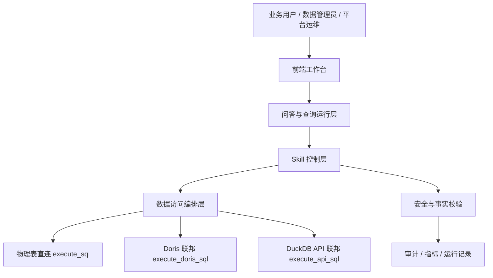

# 受控业务问答平台 · 完整提升设计（v2 收敛版）

> 日期：2026-08-18 ｜ 状态：**统一版**（原 v2 收敛稿 + 实现规格附录已并入文末「附」；独立附录文件已删除；执行已恢复）
> 收敛对象：`docs/优化方向分析报告_20260817.md`（分析层，事实基线）＋ `docs/优化设计实施方案_20260817.md`（六项执行设计）＋ 本次「四层架构 / Skill 受控剧本 / 三引擎编排 / 事实驱动」方案。
> 定位：本文档是**唯一权威收敛稿**（含实现规格）；前两份文档保留为过程证据，冲突处以本文档「§1.4 事实修正」与「§12 冻结点」为准。

---

## 0. 一句话目标

把 DeepAssetLens 从「多个管理页 + 一个自由 Agent 聊天框」，升级为：

```text
受控业务问答平台
= 受版本管理的 Skill 剧本
+ 数据访问编排层
+ 可审计的查询运行系统
+ 分角色的前端工作台
```

落地路径分三阶段（§10）：**阶段 A 先关自由度（Skill 受控化）→ 阶段 B 提准确性与数据访问（QueryContract + 事实驱动）→ 阶段 C 前端平台化与生产治理**。

---

## 1. 事实基线（仓库现状复核，写设计前先对账）

### 1.1 前端已落地（本会话已执行并验证 ①②③④）

| # | 项 | 落点（file:line 证据） | 验证 |
|---|---|---|---|
| ① | 卫生治理 | git rm 5 项已跟踪临时产物；`frontend/.gitignore` 补 `_*.txt/_*.md/_*.tsv`、`frontend/_screenshots/`；注释修复 `frontend/src/setupProxy.js:8`、`frontend/src/services/dataIntelligenceApi.ts:8`、`frontend/src/components/ApiMappingTab.tsx:317`；移除死依赖 `@xyflow/react` | git status 干净 |
| ② | 路由 lazy | `frontend/src/routes.tsx` 13 个组件全部 `lazy(() => import(/* webpackChunkName */))`；`frontend/src/components/AppTabs.tsx:118` 内容区包 `<Suspense>`；新建 `frontend/src/components/AppErrorBoundary.tsx`；`frontend/src/index.tsx` 包 ErrorBoundary | `npm run build` 出命名 chunk（main 1.07MB / 各页 41–65KB / vendor 1.48MB） |
| ③ | API 契约 + 收敛 | 新建 `frontend/src/services/http.ts`（`createApiClient` 工厂：token 注入、401 清 token、非 401 统一 `message.error(detail)`、`silent` 开关）、`frontend/src/services/types.ts`（`ApiResp<T>`/`DataSource`/`ConceptDTO`/`EntityDTO`…）；`api.ts` 换 `v1Api` 并新增 `dataSourceApi`/`aclApi`/`dorisApi`（均透传 `config?: AxiosRequestConfig`）；`skillV2Api`/`dataIntelligenceApi` 换 `createApiClient`；6 处组件绕行点清零 | `axios.create` 全库仅剩 `services/http.ts:24`；`from 'axios'` 仅 http.ts（运行时）＋api.ts（仅类型） |
| ④ | 渲染 memo | `ConversationMessageList.tsx` 抽 `MessageRow`（`React.memo`，live props 仅传末条）；`AssistantCanvas.tsx`、`CardRenderer.tsx` `export default React.memo(...)`；`FreePlanChat.tsx` 补 `useCallback`（`handleRecommendationSelect`、`handleDeleteMessage`） | 前端 3 套 / 28 全绿 |

> 统一错误层语义：组件已带精细报错处一律传 `{ silent: true }` 避免双 toast（`silent` 通过 `declare module 'axios' { interface AxiosRequestConfig { silent?: boolean } }` 全局生效）。

### 1.2 ⑤ 巨型拆分冻结点（中断未生效，勿丢）

- `frontend/src/components/model-tree/modelTree.tsx` **已创建**（纯工具层：`MODE_CONFIG`/`LEVEL_LABELS`/`getEntityCategory*`/`sortByDisplay`/解释词工具组/`buildTree`/`findFirstKey`）。
- `frontend/src/components/ModelTreeManager.tsx` **未被改动**（本地定义仍在 L52/L63–L315，可编译）。→ 恢复执行时二选一（§12）。

### 1.3 后端现状（设计借力点，勿重造）

- **三引擎工具面已就位**：`backend/app/mcp_server.py:113–146`（`batch_entity_source_mode`/`execute_api_sql`/`execute_doris_sql`/`execute_sql`/`execute_entity_api`）。
- **围栏链路已存在**：`backend/app/services/decision_gate.py:39`（`SCOPE_GATED_TOOLS`）、`scope_adapters.py`（工具×范围适配，支持双载体 SQL/filters）、`secure_query_executor.py`（统一拦截 SQL 型工具）、`run_event_sink`；**模式锁** `tupu_deepagent.py:1141`（实体 source_mode 锁定工具，禁跨模式重试）。
- **测试基线**：后端 `pytest` 178 passed / 6 deselected；`_response_format=None`（GLM 兼容）不可改。
- **Skill 五件套现状**：`distribution-overload` 已有 `reference/`(5 文件)、`templates/`(4 文件)、`examples/`(1)、`scripts/`(1，`validate_output_contract.py`)。

### 1.4 对原稿的事实修正（差异必须明示）

1. **`examples/`、`scripts/` 已存在** → 原稿「缺 examples/ 与 scripts/」不成立；真实缺口收敛为：**frontmatter 契约（`x_tupu`）+ 代码路由/策略接线 + 输出契约的机器可执行化**。
2. **「前十行 Markdown 明细表」规则已解决**：`distribution-overload/SKILL.md:66` 已明确「禁止输出与结果表同字段的 Markdown 明细表…前端会在存在权威 `sql_result` 时自动屏蔽 Markdown 表格节点」。原稿所说残留冲突不再成立；剩余工作是**把 prose 规则结构化**（§4.2 映射表）。
3. **KeepAlive 现状**：`frontend/src/components/AppTabs.tsx:6` 全常驻挂载（`display:none` 切换），**无 LRU**；`routes.tsx:5` 注释已确认 lazy 不影响已挂载页签。→ ②只完成了 lazy 一半，**KeepAlive LRU 是本次新增设计项**（§8.1）。
4. **「样本≠全量」原则已内嵌**：`SKILL.md:69` 已是事实驱动雏形；本次设计把它提升为**后端可强制执行的断言检查器**（§6），不是新理念，而是落地。
5. 后端「前端只读唯一权威结果表」与 Skill「输出列规范」已对齐（`SKILL.md:71–95` 定义了前端查询结果表列结构）→ 输出契约 = 把这段表定义转成 `output_mode` + 模板列契约（§4.2）。

---

## 2. 总体架构：四层，不是继续堆页面



| 层 | 负责什么 | 不负责什么 | 仓库落点 |
|---|---|---|---|
| 前端工作台 | 展示、确认、管理、审计、二次分析、剧本工作台 | 决定 SQL 或权限 | `frontend/src/pages`、`components/conversation`（§7 重构） |
| 问答与运行层 | 会话、SSE、任务状态、取消、结果交付 | 自由决定业务流程 | `data_intelligence.py`、`frontend/src/pages/FreePlanChat.tsx`（→ FreePlanWorkspace） |
| Skill 控制层 | 路由命中、步骤推进、工具白名单、模板参数、终止条件 | 直接执行数据库细节 | `tupu_deepagent.py`、`backend/data/skills/**`（新增三控制件 §4.4） |
| 数据访问编排层 | 选引擎、预算、超时、降级 | 解释业务含义 | `kg_api.py`（选路）、`secure_query_executor.py`（执行） |

---

## 3. 已执行六项与新架构的收敛映射

| 六项 | 对应新架构位置 | 状态 |
|---|---|---|
| ① 卫生治理 | 工程基础（无架构语义） | ✅ 已执行 |
| ② 路由 lazy | §8.1「路由 lazy + KeepAlive LRU」的前半 | ✅ 已执行（LRU 为新增增量） |
| ③ API 契约 + axios 收敛 | §8.3「API Client 与 DTO 收敛」的底座（http.ts 已建） | ✅ 已执行（剩余为 403/429/5xx/日志脱敏 + DTO 覆盖五主链） |
| ④ 渲染 memo | §8.2「巨型组件按领域拆分」的对话链路部分 | ✅ 已执行 |
| ⑤ 巨型组件拆分 | §8.2（ModelTreeManager 优先，按领域不按行数） | ⏸ 冻结（§1.2） |
| ⑥ 后端巨型文件拆分 | 与阶段 A 的 `SkillCatalog` 落地耦合（先抽 Skill 域，后动执行链） | ⏳ 未开始（§10 给出新顺序） |

> 重要收敛：**⑥ 的顺序被新架构改写**。原「按文件行数拆 7 个后端大文件」调整为「**先做 Skill 域（SkillCatalog/SkillRouter/SkillPolicyMiddleware）的模块化抽取，再拆执行链大文件**」——因为三控制件本身就会把 `tupu_deepagent.py` 的「路由+策略」职责切走，物理拆分自然发生，避免为拆而拆。

---

## 4. Skill 受控剧本（阶段 A 核心，最优先）

### 4.1 控制模型转变

```text
现状：模型看技能概要 → 自主决定读哪个 Skill → 自主决定下一步工具 → 自主决定是否继续
目标：代码路由命中 Skill → 固定当前 Workflow Step → 只暴露该步骤允许的工具
     → 模型只填参数、说明理由、解释已验证结果 → 代码决定是否进入下一步或终止
```

业务场景优先走受控模式；只有未覆盖的问题才允许有限自由问答，且**绝不自动从剧本退回完全自由的 free-plan**（§4.4 违规策略）。

### 4.2 `SKILL.md` 唯一来源 + 机器可读契约

保留唯一 `SKILL.md`，frontmatter 扩展 `x_tupu` 段；**正文 prose 与结构化字段的映射**（用 distribution-overload 实证）：

| 现有 prose（distribution-overload/SKILL.md） | 结构化字段 | 说明 |
|---|---|---|
| L2 description「何时用」+ L30–36 触发条件 | `x_tupu.triggers.any` | 命中即路由，不再靠模型阅读理解 |
| L10–17「执行前必查数据源模式」工具选择铁律 | `x_tupu.allowed_tools` | 步骤级白名单；`batch_entity_source_mode` 只填参数 |
| L19–53 三步执行 + 按需读子文件导航 | `x_tupu.workflow[]`（`when/template/requires/allowed_next/output_mode`） | 步骤与模板导航机器化，read_file 改由代码指引 |
| L55–61 最小终止规则 | `x_tupu.workflow[].stop_when` | 「row_count ≥ 0 即终止」「禁 task/分页重查」代码强制 |
| L63–69 输出格式硬规则 | `x_tupu.workflow[].output_mode`（`single_result_table`/`analysis_and_result_table`…）+ 模板列契约 | 明细唯一走前端查询结果表，禁 Markdown 明细表 |
| L71–95 输出列规范 | `output_mode` 下挂列结构（或引用 templates/*.sql 的 SELECT 列） | 「前端唯一权威结果表」的机器可校验版本 |
| L97–108 降级规则 | `x_tupu.fallback` + 运行期降级矩阵（§9） | 降级也是受控行为 |

frontmatter 完整示例（收敛原稿，补 `output_mode` 与 `requires` 细节）：

```yaml
---
name: distribution-overload
description: 户变关系、重过载、负荷占有率分析。
category: scenario
version: 1.0.0

x_tupu:
  priority: 100
  triggers:
    any:
      - ["户变关系", "用电户"]
      - ["户变关系", "发电户"]
      - ["重载"]
      - ["过载"]
      - ["上网负载"]

  allowed_tools:
    - batch_entity_source_mode
    - execute_sql
    - execute_doris_sql
    - execute_api_sql

  workflow:
    - id: relationship
      when: ["户变关系", "用电户与配变", "发电户与配变"]
      template: templates/step1_household_transformer.sql
      requires: []
      allowed_next: ["final"]
      stop_when: "row_count >= 0"
      output_mode: single_result_table

    - id: overload
      when: ["重载", "过载", "负载率"]
      template: templates/step2_power_aggregation.sql
      requires: ["date"]
      allowed_next: ["load_ratio", "final"]
      output_mode: analysis_and_result_table

  forbidden_tools: [task, write_file, search_entities, fetch_join_expr, fetch_l1_l2_tree, fetch_subgraph]
---
```

### 4.3 五件套标准与现状

| 件 | 职责 | distribution-overload 现状 | 缺口 |
|---|---|---|---|
| `SKILL.md` | 唯一入口：元数据、路由、步骤、口径、资源导航 | ✅ 有（prose 化） | **加 `x_tupu` 契约** |
| `reference/` | 业务规则、字段、码表、权限与范围 | ✅ 5 文件 | 无 |
| `templates/` | 受控 SQL 模板 | ✅ 4 文件 | `stop_when`/列契约标注 |
| `examples/` | 标准输入/输出/反例 | ✅ `household-transformer-output.md` | 补反例与边界（稀疏/空数据） |
| `scripts/` | 静态校验、模板参数校验、回归 | ✅ `validate_output_contract.py` | 挂到 SkillCatalog 编译期 + CI |

**分类策略**（非所有 Skill 凑五件套，YAGNI）：`explain-concept` 类只留 `SKILL.md`；`distribution-overload`/`project-lifecycle-cost` 生产场景完整五件套；`sql-query` 高风险通用能力加 `reference/`+`scripts/`。

### 4.4 后端三控制件（加在现有链路上，不推翻 DeepAgent）

#### ① `SkillCatalog` —— 编译技能，不手写索引
- 启动扫描 `backend/data/skills/**` 全部 `SKILL.md`；解析 YAML frontmatter；校验模板/引用/工具声明存在；算内容哈希与版本；构建内存目录。
- **失败即阻止该 Skill 发布**，不影响已发布 Skill；改动走版本灰度，不在运行中静默漂移。
- 落点：新增 `backend/app/services/skill_catalog.py`（或 `backend/app/skills/` 包）；`scripts/validate_output_contract.py` 接入编译期。
- 与现有索引的衔接：替代/收敛 `data_intelligence.py` 里手写工具名册（L40–65）与 Skill 说明副本，消除漂移源。

#### ② `SkillRouter` —— 代码路由，不让模型猜
- 输入：用户问题 + 会话上下文 + 用户权限 + 数据域可用性。
- 输出（收敛原稿，补 `output_mode`/`route_reason`）：

```json
{
  "route_mode": "scenario",
  "skill_name": "distribution-overload",
  "skill_version": "1.0.0",
  "workflow_step": "relationship",
  "required_slots": [],
  "allowed_tools": ["batch_entity_source_mode", "execute_sql"],
  "output_mode": "single_result_table",
  "route_reason": "命中“户变关系 + 用电户”规则"
}
```

- 优先级：`已确认的连续上下文 → 精确场景剧本 → 需澄清 → 通用受限能力 → 低权限 fallback`。
- 「所有用电户与配变户变关系」必须稳定命中 `distribution-overload / relationship`（对接 `triggers.any` 规则引擎，不依赖模型判断"没提过载要不要走剧本"）。
- 落点：新增 `backend/app/services/skill_router.py`；路由结果进 `run_event_sink` 供前端展示「为什么走这一步」。

#### ③ `SkillPolicyMiddleware` —— 真正把牢笼关上
- 职责：校验「这一步到底能不能这么干」：
  - 工具是否在当前 **Skill** 白名单、当前 **Step** 白名单；
  - SQL 是否来自允许模板（模板指纹/哈希）；
  - 参数是否满足 Schema（`requires`/`required_slots`）；
  - 是否违反终止条件（`stop_when`）、是否跳过必经步骤（`allowed_next`）；
  - 是否试图调 `task`/子代理/`write_file`/自由 Shell（对照 `forbidden_tools`）；
  - 是否在已有完整结果后继续重查、是否在 `single_result_table` 模式输出 Markdown 明细表。
- 违规策略（与原稿一致）：首次拒绝本次调用并返回明确原因与允许动作；再次终止当前运行；**绝不自动退回完全自由的 free-plan**。
- **与现有链路的分工（关键边界，避免重造）**：
  - `decision_gate`（范围/理由）与 `scope_checker`/`scope_adapters`（工具×范围双载体）继续当**执行兜底**，不动；
  - `secure_query_executor`（SQL 型工具统一拦截）继续当**执行闸门**，不动；
  - **SkillPolicyMiddleware 是「剧本层」策略**，叠加其上：先过剧本策略，再过范围/执行闸门；新增，不改旧件；
  - `_response_format=None`（GLM 兼容）不可改；9385 容器沙箱仍为不可信代码强制执行边界（§11）。

### 4.5 首个样板改造清单（distribution-overload，文件级）

1. `backend/data/skills/scenarios/distribution-overload/SKILL.md`：frontmatter 加 `x_tupu`（§4.2 示例）；正文保留 prose 作人读说明。
2. 三控制件落地 + `SkillRouter` 命中规则（`triggers.any` → `relationship`）。
3. `scripts/validate_output_contract.py` 挂编译期；`examples/` 补反例。
4. 路由模拟器最小版（前端，§7.3）。
5. 验收（§10-A 验收目标）。

---

## 5. 数据访问编排层（阶段 B）

### 5.1 现状 → 目标
- 现状：`kg_api.batch_entity_source_mode` 已实现推荐逻辑（`backend/app/api/kg_api.py:272–361`：单源物理→Doris→API→兜底，含 `recommended_tool`），模型按提示「铁律，不可切换」选工具。
- 目标：**引擎选路收敛为代码统一出口**，模型只拿「可选路径」结果，不能自行绕过 Router 指定引擎；`batch_entity_source_mode` 的输出成为 `QueryContract.selected_engine` 的输入，选路规则不再散落在 SKILL.md prose（L10–15）里。

### 5.2 引擎选路规则（固化代码，收敛原稿）

```text
单数据源、实时明细                      → physical（execute_sql）
多数据源、全部已纳入 Doris Catalog      → doris_federated（execute_doris_sql）
涉及 API 虚拟表或 API 与库表关联        → api_federated（execute_api_sql）
多个路径都可用                          → 权限 > 新鲜度 > 预计扫描量 > 延迟 > 成本
```

与现有 `kg_api.batch_entity_source_mode` 的映射关系：推荐逻辑保留，扩展排序因子（权限/新鲜度/成本）并暴露给前端「数据访问卡」。

### 5.3 `QueryContract`（模型补参数、代码执行全链）

```json
{
  "intent": "household_transformer_relation",
  "skill": "distribution-overload",
  "workflow_step": "relationship",
  "scope": { "customer_names": ["客户001", "客户003"], "commitment": "exact_set" },
  "template_id": "distribution-overload.relationship.v1",
  "query_kind": "detail",
  "required_facts": ["row_count"],
  "selected_engine": "physical"
}
```

执行链（代码执行，生产场景模型不再发送原始 SQL 主体）：

```text
参数校验 → 模板渲染 → SQL AST 校验 → 权限校验 → 行数/成本预算 → 引擎执行 → 事实提取 → 最终交付
```

`SQL AST 校验 / 行数成本预算 / 超时取消` 落在 `secure_query_executor` 扩展点上（不动其现有拦截逻辑，加预算/取消钩子）。

### 5.4 与模式锁的关系
`tupu_deepagent.py:1141` 的「模式锁」保留：QueryContract 生成的引擎必须与实体 source_mode 一致，冲突时拒绝并返回原因，**不做跨模式静默重试**（对齐现有 L131 硬规则）。

---

## 6. 事实驱动回答（阶段 B）

### 6.1 统一事实对象（收敛原稿）

```json
{
  "facts": {
    "row_count": { "value": 101, "evidence": "query_result" },
    "customer_status_distribution": { "value": {"正常": 98, "异常": 3}, "evidence": "aggregate_sql" },
    "single_route_count": { "value": 96, "evidence": "aggregate_sql" }
  }
}
```

事实采集点：SQL 型工具返回的 `row_count`/`returned_rows`（`SKILL.md:58` 已有区分）→ 结构化进 `facts`；聚合/排序类 SQL 结果 → `aggregate_sql` 证据。

### 6.2 结论允许依据表

| 结论类型 | 允许依据 |
|---|---|
| 「共 101 条」 | 工具真实 `row_count` |
| 「全部正常」 | 显式聚合事实 |
| 「最高 / 最低 / 排名」 | 聚合/排序 SQL 事实 |
| 「样本显示」 | 前十行模型样本 |
| 「可能 / 建议进一步核实」 | 未覆盖全量时的受控表述 |

### 6.3 全量断言检查器
- 最终答案生成前扫描「全部/均/所有/无/唯一/最高/最低/覆盖」等强断言词；
- 查不到对应 `facts` 证据 → 自动降级为「样本显示」或删除该句；
- **落点建议**：后端 final_delivery 阶段（与 `_response_format` 无冲突，纯文本后处理）＋ 前端「证据抽屉」展示每句结论的事实来源（§7.1 EvidenceDrawer）。
- 现状映射：`SKILL.md:69` 已是此原则的 prose 版 → 检查器把它从「模型自觉」变「代码强制」。
- 降级矩阵：`SKILL.md:97–108`（稀疏/空/只问单类）继续作为 prose 指南，运行期归入 §9 降级表。

---

## 7. 前端产品重构（阶段 B/C，与工程治理并行）

### 7.1 业务用户：智能数据工作台（现 FreePlanChat 拆分）
```text
FreePlanWorkspace/
├─ ConversationPane          # 问答、输入、会话（现 FreePlanChat 的对话主体）
├─ RunTimeline               # 为什么执行下一步（接 SkillRouter 结果）
├─ QueryContractCard         # 已选剧本、范围、当前步骤
├─ DataAccessCard            # 为什么走物理/Doris/DuckDB（接 batch_entity_source_mode）
├─ ResultWorkspace           # 结论、事实、唯一数据表（现 AssistantCanvas 的 final_delivery）
├─ EvidenceDrawer            # 每项结论的证据（facts）
└─ QueryPlanConfirmDialog    # 高风险查询确认（超预算/越权限）
```
用户可见流程：`已选择剧本 → 已锁定范围 → 已选择数据访问路径 → 正在执行哪一步 → 得到了什么事实 → 最终结论 → 唯一查询结果表`；未做步骤也要显示「未执行：重过载分析 / 原因：当前问题只要求户变关系」。
- 与④的关系：`ConversationMessageList`/`AssistantCanvas` 已 memo 化，重构时保持热路径隔离。

### 7.2 数据管理员：数据访问中心（收敛 DataSourceConfig/DorisConfig/ApiMappingTab）
```text
数据访问中心
├─ 数据源总览    # 物理库 / Doris Catalog / API 虚拟表
├─ 对象路由      # 实体→数据源 / →Catalog / →API 映射 / 推荐执行路径
├─ 联邦关系      # 关联键 / 可用引擎 / 数据新鲜度
├─ 查询治理      # 权限 / 脱敏 / 超时 / 行数上限 / 降级策略
└─ 运行观测      # 查询记录 / 预算命中 / 取消 / 审计
```
- 与③的关系：三个现有页的 API 已收敛进 `dataSourceApi`/`dorisApi`/`diApi`，重构仅改 UI 聚合与新增路由/观测页，不新增 axios 绕行。

### 7.3 Skill 管理员：剧本工作台（新增）
```text
Skill 工作台
├─ Skill 列表与版本（接 SkillCatalog）
├─ 编辑器：正文 + frontmatter 校验
├─ 资源浏览：reference/templates/examples/scripts
├─ 路由模拟器（阶段 A 就要的最小版）
├─ 参数模拟器 / 工具白名单预览 / SQL 模板试运行
├─ 测试样例 / 灰度 / 发布 / 回滚
```
- **路由模拟器**（阶段 A 最小版）：输入一句话 → 展示命中 Skill/Step/允许工具/禁止工具/输出模式。例：
```text
输入：所有用电户与配变户变关系
命中：Skill=distribution-overload v1.0.0；Step=relationship
允许工具：batch_entity_source_mode / execute_sql
禁止工具：task / search_entities / write_file
输出模式：single_result_table
```

---

## 8. 前端工程治理（阶段 C，与功能设计一起做，不是先拆文件）

### 8.1 路由 lazy + KeepAlive LRU（② 的增量）
- 现状：② 已完成 lazy（首屏包体降），但 `AppTabs.tsx:6` 全常驻（13 个大页长期占内存）。新设计明确：**lazy 解决加载，LRU 解决常驻**。
- 设计：
  - 布局、首页、当前活动页：常驻；
  - 大型管理页（图谱/模型树/映射/数据源/指标）：不默认 KeepAlive，仅保留**最近 N 个**管理页缓存（LRU，N 建议 3）；
  - 离开页签释放大图实例、monaco 编辑器、查询结果、轮询（ForceCanvas 已有 `页签激活时刷新尺寸` 钩子可复用反向——失活即释放）；
  - 每个 lazy 边界配 `Suspense + ErrorBoundary`（② 已建 `AppErrorBoundary.tsx`，复用）。
- 状态模型：`AppTabs` 内部维护 `最近使用栈`；激活/切换更新栈；超出 N 弹最久未用的非活动页签卸载。

### 8.2 巨型组件按领域拆分（⑤ 的新规范 + 冻结点处置）
- 原则（收敛原稿）：**按领域状态拆，不按行数机械拆**。每页面遵守：
  - 页面容器：路由、权限、布局；
  - `hooks/`：请求、缓存、状态机；
  - `components/`：纯展示；
  - `services/`：API 调用（不 new axios、不拼 URL）；
  - `types/`：接口类型。
- 优先级：①`ModelTreeManager` → ②`MappingManager` → ③`SourceManager` → ④`MetricManager` → ⑤`FreePlanChat` → ⑥`RightPanel`。
- `ModelTreeManager` 拆分蓝图（收敛原稿 + 已建 modelTree.tsx）：
```text
model-tree/
├─ modelTree.tsx            # ✅ 已建：纯工具层（buildTree/MODE_CONFIG/解释词工具）
├─ ModelTreeContainer        # 容器：状态 + 数据加载（useModelTreeQuery）
├─ ModelTreeSidebar          # 左树
├─ ModelDetailPanel          # 右详情（概念/实体/属性 三 render*）
├─ ModelFormDrawer           # 概念/实体/属性/字段关键字 Modal
└─ modelTree.types.ts        # 类型（Mode/ExplanationItem/Props…）
```
- 冻结点处置：`modelTree.tsx` 已建未接线（§1.2/§12）。

### 8.3 API Client 与 DTO 收敛（③ 的增量）
- 已建底座：`http.ts`（token/401/统一错误/silent）+ `types.ts`。
- 待增：403 权限提示、429 限流提示、5xx 可重试策略、请求/响应日志脱敏、tenant/trace-id 注入。
- DTO 覆盖优先级（不一次清 912 个 any）：问答（data-intelligence）、数据源、Doris、API 映射、权限五条主链；服务层逐步去 `any`。
- 禁止清单（写入规范）：页面 `axios.create()`、页面写后端 URL、服务层 `any`、返回值不经 DTO。

### 8.4 治理顺序
```text
先 8.1 路由生命周期（内存基线）→ 8.2 巨型组件按领域拆（配合 ⑤）→ 8.3 API/DTO（增量）→ 与 7.1/7.2/7.3 功能重构互斥排期
```

---

## 9. 生产运行与降级策略

| 情况 | 后端动作 | 前端表达 |
|---|---|---|
| Skill 未命中 | 走通用受限查询 | 「按通用数据查询处理，未使用业务剧本」 |
| Skill 缺必要参数 | 不调工具 | 澄清卡片（`QueryContract.required_slots`） |
| Doris 不可用 | 判断能否物理表降级 | 「跨源能力暂不可用，已返回可用数据源结果」 |
| API 超时 | 保留已完成部分 | 「项目接口超时，客户数据已返回」 |
| SQL 超预算 | 不执行 | 「为保护系统，请缩小日期/客户/台区范围」 |
| LLM 失败、SQL 成功 | 确定性交付 | 「数据已查询完成，完整明细见结果表」 |
| 数据不足以全量结论 | 禁止断言（§6.3） | 「样本显示，需执行汇总验证后确认全量结论」 |
| 模式锁冲突 | 拒绝并返回原因（§5.4） | 「当前实体数据源模式为 X，禁止 Y 引擎」 |

---

## 10. 分批落地路线

### 阶段 A：先关自由度（建议 4 周内）
- 交付：`SkillCatalog` → `SkillRouter` → `SkillPolicyMiddleware` → 场景 Agent 工具过滤 → 受控模板参数化 → `distribution-overload` 首个样板（§4.5）→ 路由模拟器最小版。
- 与六项的关系：本阶段同时完成「⑥ 后端 Skill 域模块化抽取」（SkillCatalog/Router/Policy 即拆分动作）。
- **验收目标（户变关系）**：
```text
户变关系问题 → 只能命中固定剧本和固定步骤 → 只能执行规定工具
→ SQL 主体来自模板 → 有完整结果即终止 → 不允许 task/分段重查/额外分析
```
- 验收手段：后端新增路由/策略单测 + 前端路由模拟器可视化 + IAB 冒烟（KeepAlive/对话链路），回归基线（后端 178/6、前端 3 套/28）全绿。

### 阶段 B：提准确性与数据访问（4–6 周）
- 交付：`QueryContract` → 三引擎 Router 收敛（§5.2）→ 聚合事实 + 全量断言检查器（§6）→ 查询预算/超时/取消/限流 → 数据访问卡 → 证据抽屉 → 金标题库与自动回归。

### 阶段 C：前端平台化与生产治理（6–8 周）
- 交付：路由 lazy + KeepAlive LRU（§8.1）→ 巨型组件按领域拆分（§8.2）→ API Client 与 DTO 收敛（§8.3）→ 数据访问中心（§7.2）→ Skill 工作台（§7.3）→ 运行观测台 → Skill 灰度/版本/回滚 → 多实例状态与分布式锁改造。

---

## 11. 风险登记与决策闸门

| 风险 | 对策 | 决策闸门 |
|---|---|---|
| 三控制件与现有围栏职责重叠 | 明确分层：剧本层（新增）→ 范围层（不动）→ 执行层（不动），单测锁定边界 | SkillPolicyMiddleware 单测须同时跑通新旧链路 |
| 路由误伤现有自由问答 | Router 未命中才走通用受限查询，绝不静默切回 free-plan | 路由优先级表 + 回归用例 |
| 受控化破坏 GLM 兼容 | `_response_format=None` 不动；受控化只加工具/步骤白名单，不改输出协议 | 后端测试全绿 |
| 巨型拆分引入行为漂移 | 行为等价验收：每拆一步跑一次基线 + IAB 冒烟 | 每步可回滚（git 不自动提交，人工确认） |
| KeepAlive LRU 误卸载活动页 | 仅弹「非活动」页签；当前活动页永不卸载 | 页签切换冒烟 |
| 断言检查器误杀合法结论 | 只降级强断言词且证据缺失的句子；保留「样本显示」表述 | 金标题库回归 |
| 不可信代码执行 | 受信作者走现有沙箱；不可信未来强制 9385 容器 | 威胁模型文档更新 |

---

## 12. 执行状态冻结点与恢复指引（设计窗口交接）

### 12.1 当前状态
- ✅ 已完成并验证：①②③④（§1.1）。
- ⏸ 冻结：⑤ 巨型拆分 —— `frontend/src/components/model-tree/modelTree.tsx` 已建未接线；`ModelTreeManager.tsx` 未改动（可编译）。
- ⏳ 未开始：⑥ 后端拆分（顺序被 §3 改写为「先 Skill 域，后执行链」）、⑧ 回归冒烟。
- 执行目标 `goal-09e20d56` 已暂停（设计窗口不触发自动执行轮次）。

### 12.2 恢复执行时的第一步（二选一，勿同时做）
1. **接线**（推荐，保留已建工具层）：给 `ModelTreeManager.tsx` 加 `import { MODE_CONFIG, buildTree, findFirstKey, splitExplanationTerms, mergeExplanationItems, buildExplanationItems, serializeExplanationItems, getPropertyKeywordOptions, getEntityCategoryLabel, EXPLANATION_SOURCE_META, type Mode, type ExplanationItem, type ExplanationSource } from './model-tree/modelTree';`，删除本地 L52 `type Mode` 与 L63–L315 工具块，并移除仅 buildTree 用的 `TagsOutlined`/`ApartmentOutlined` 图标 import（`DatabaseOutlined` 保留）。
2. **撤销**：删除 `model-tree/modelTree.tsx`，保持现状。

> 注：L63–L315 工具块与 `modelTree.tsx` 内容已逐行核对一致（含 `getEntityCategoryPreset`/`sortByDisplay`/`QUERY_ENTITY_PROPERTY_HINTS` 等仅 buildTree 内部使用的符号，均在工具层保留）。

### 12.3 本窗口约束
- 本窗口只做设计、不改代码、不跑测试（用户明示）；本文档即本窗口交付物。
- 下窗口若恢复执行：按 §10 阶段 A 优先（Skill 受控化），六项执行融入其中（§3 映射）。

---

## 附：最终原则（写入架构规范）

> **Skill 决定业务流程；Router 决定执行路径；模板决定 SQL 主体；Policy 决定能否执行；事实决定最终结论；LLM 只负责理解、参数补全、理由说明与自然语言表达。**

---

## 附：实现规格深化（原《设计深化附录》并入）

> 日期：2026-08-18 ｜ 性质：**设计深化附录**，不含任何代码改动或测试执行（遵守本窗口「只做设计」约束）
> 上游：《受控问答平台提升设计_20260818.md》（v2 收敛稿）。本附录把 v2 的架构结论细化为**可直接照做的实现规格**：契约草案、伪代码、检查清单、Schema、文件落点、批次表。
> 覆盖对账：用户设计稿的九节（四层/Skill 剧本/三控制件/三引擎/事实驱动/三工作台/工程治理/降级/分批路线）在 v2 与本文档均已覆盖，无遗漏。

---

## 1. `x_tupu` frontmatter 契约（distribution-overload 完整草案）

### 1.1 目标 SKILL.md frontmatter（替换现有 L1–5 的 name/description/category）

```yaml
---
name: distribution-overload
description: 配电变压器重过载分析（户变关系→台区级96点功率汇集→客户负载占有率倒排）。
category: scenario
version: 1.0.0

x_tupu:
  priority: 100

  # 命中即路由（对应现有 SKILL.md L30-36「触发条件」）
  triggers:
    any:
      - ["户变关系", "用电户"]
      - ["户变关系", "发电户"]
      - ["重载"]
      - ["过载"]
      - ["负载率"]
      - ["96点功率"]
      - ["上网负载"]
      - ["负载占有率"]

  # 步骤级工作流（对应现有 L19-53「三步执行 + 按需读」；allowed_next 对应 L55-61「最小终止」）
  workflow:
    - id: relationship
      when: ["户变关系", "用电户与配变", "发电户与配变"]
      template: templates/step1_household_transformer.sql
      requires: []
      allowed_next: ["final", "overload"]
      stop_when: "row_count >= 0"
      output_mode: single_result_table

    - id: overload
      when: ["重载", "过载", "负载率", "96点功率"]
      template: templates/step2_power_aggregation.sql
      requires: []
      allowed_next: ["continuous", "load_ratio", "final"]
      stop_when: "row_count >= 0"
      output_mode: analysis_and_result_table

    - id: continuous
      when: ["连续N天", "持续重过载", "连续几天"]
      template: templates/step2b_continuous_days.sql
      requires: ["N"]
      allowed_next: ["final"]
      stop_when: "row_count >= 0"
      output_mode: analysis_and_result_table

    - id: load_ratio
      when: ["负载占有率", "倒排", "影响最大"]
      template: templates/step3_load_ratio.sql
      requires: []
      allowed_next: ["final"]
      stop_when: "row_count >= 0"
      output_mode: analysis_and_result_table

  # 工具白名单（对应现有 L10-17「执行前必查数据源模式」的 4 工具）
  allowed_tools:
    - batch_entity_source_mode
    - execute_sql
    - execute_doris_sql
    - execute_api_sql

  # 绝对禁止（对应现有 L16「无需调 search_entities/...」，升级为强制）
  forbidden_tools:
    - task
    - write_file
    - search_entities
    - fetch_join_expr
    - fetch_l1_l2_tree
    - fetch_subgraph
    - validate_attributes

  # 降级（对应现有 L97-108，机器可审计）
  fallback:
    - condition: "doris Unknown table/catalog"
      action: "execute_sql 物理直连重试一次"
    - condition: "row_count == 0"
      action: "回复未查到相关数据，禁止跨模式重试"
    - condition: "功率数据 < 8 个时间点"
      action: "结论注明『数据稀疏，连续性为近似』"
---
```

### 1.2 SkillCatalog 编译期校验规则（设计级）

| 校验 | 规则 | 失败处理 |
|---|---|---|
| frontmatter 可解析 | `yaml.safe_load` 成功且含 `x_tupu` | 阻止发布，报该 Skill 错误 |
| `triggers.any` 结构 | 每个元素是 `string[]`（同组 AND、组间 OR） | 阻止发布 |
| `workflow[].template` | 相对路径存在且扩展名 `.sql` | 阻止发布 |
| `allowed_tools` | 全部 ∈ 全局工具名册（`mcp_server.py` 已注册的 16 个动作） | 阻止发布 |
| `forbidden_tools` | 全部 ∈ 全局工具名册 | 阻止发布 |
| `workflow[].output_mode` | ∈ 枚举 `single_result_table / analysis_and_result_table / clarify / text` | 阻止发布 |
| `allowed_next` | 每个目标 ∈ 本 Skill 的 `workflow[].id` ∪ `{final}` | 阻止发布 |
| 内容哈希 | 计算 SKILL.md + 五件套文件哈希；同 version 下哈希变化 = 未灰度改动，拒绝运行中生效 | 日志告警 + 用旧版本 |

---

## 2. SkillRouter 匹配与优先级（实现规格）

### 2.1 输入 → 输出

```text
输入：question + session_context(近 N 条已确认意图) + user_permissions + data_domain_availability
输出：{ route_mode, skill_name, skill_version, workflow_step, required_slots, allowed_tools, output_mode, route_reason }
```

### 2.2 匹配伪代码（设计级）

```python
def route(question, ctx, perms, domains):
    # 1) 已确认的连续上下文：若上一轮已锁定 Skill 且用户未换题（无强否定词），沿用
    if ctx.locked_skill and not has_reset_signal(question):
        return reuse(ctx.locked_skill, ctx.workflow_step)

    # 2) 精确场景剧本：triggers.any 命中（组内 AND、组间 OR，词面 + 同义词表）
    for skill in catalog.by_priority():
        hit = skill.match_triggers(question)          # 规则引擎，不走 LLM
        if hit:
            step = skill.select_step(question)         # workflow[].when 组内 AND
            return route_scenario(skill, step)

    # 3) 需澄清：命中 Skill 但 required_slots 缺失（如 continuous 缺 N）
    if pending := catalog.skills_needing_slots(question):
        return route_clarify(pending)

    # 4) 通用受限能力：sql-query / explain-concept 等通用 Skill
    if g := catalog.generic_match(question):
        return route_generic(g)

    # 5) 低权限 fallback：通用受限查询 + 明确标注「未使用业务剧本」
    return route_generic_low_perm()
```

### 2.3 与现有 DeepAgent 的接线点（关键）

- `tupu_deepagent.py` 现有「场景剧本优先，跳过通用定位流程」（对应 `SKILL.md:9-16`）由 **SkillRouter 命中结果替代**：命中 scenario 后，模型不再走 `search_entities/fetch_join_expr/fetch_l1_l2_tree/fetch_subgraph/validate_attributes`。
- 路由结果写入 `run_event_sink`（`route_mode/skill_name/workflow_step/route_reason`），前端 `RunTimeline` 直接消费——**不做第二次 LLM 路由**，避免双源漂移。
- 兜底：Router 未命中任何 Skill 时，才允许走现有通用受限查询链（`search_entities → … → execute_*`），且前端标注「按通用数据查询处理，未使用业务剧本」。

---

## 3. SkillPolicyMiddleware 检查项清单（逐条实现规格）

| # | 检查项 | 输入证据 | 违规动作（首次→再次） | 落点 |
|---|---|---|---|---|
| 1 | 工具 ∈ Skill 白名单 | Router 输出的 `allowed_tools` | 拒绝本次 → 终止运行 | 工具调用入口（`dispatch_kg_action` 前） |
| 2 | 工具 ∈ 当前 Step 白名单 | `workflow[].allowed_tools`（Step 级） | 拒绝本次 → 终止 | 同上 |
| 3 | SQL 来自允许模板 | SQL 文本与 `workflow[].template` 指纹（模板哈希 + 参数注入点校验） | 拒绝本次 → 终止 | 模板渲染后、执行前 |
| 4 | 参数满足 Schema | `requires`/`required_slots` 与运行时参数 | 需澄清（不执行） | 执行链起点 |
| 5 | 不违反终止条件 | `stop_when`（如 `row_count >= 0` 即终止） | 拒绝继续重查 → 终止 | 每次工具返回后 |
| 6 | 不跳过必经步骤 | `allowed_next`（如 relationship → final 未经过 overload 跳 load_ratio） | 拒绝本次 → 终止 | 步骤推进处 |
| 7 | 不调子代理/写文件/自由 Shell | `forbidden_tools`（task/write_file/…） | 拒绝本次 → 终止 | 工具入口 |
| 8 | 有完整结果后不重复查 | `stop_when` 命中后仍触发查询工具 | 拒绝 → 终止，输出「当前剧本不允许该扩展操作」 | 工具入口 |
| 9 | `single_result_table` 不输出 Markdown 明细表 | 交付文本含表格节点且 `output_mode=single_result_table` | 剥离该表格节点 → 终止 | final_delivery 阶段 |

**分层边界（不重造）**：SkillPolicyMiddleware 是「剧本层」策略；`decision_gate`（有无理由/范围是否越界）、`scope_adapters`（工具×范围双载体）、`secure_query_executor`（SQL 型工具统一拦截）继续作为**执行兜底**，原样保留；`_response_format=None` 不改。违规策略统一：**首次拒绝返回原因与允许动作；再次终止；绝不自动退回 free-plan**。

---

## 4. QueryContract Schema + 执行链落点

### 4.1 QueryContract（JSON Schema 草案）

```json
{
  "type": "object",
  "required": ["intent", "skill", "workflow_step", "scope", "template_id", "query_kind"],
  "properties": {
    "intent":        { "type": "string" },
    "skill":         { "type": "string" },
    "skill_version": { "type": "string" },
    "workflow_step": { "type": "string" },
    "scope":         { "type": "object", "properties": { "commitment": { "enum": ["exact_set", "subset", "approx"] } } },
    "template_id":   { "type": "string" },
    "query_kind":    { "enum": ["detail", "aggregate", "ranking"] },
    "required_facts": { "type": "array", "items": { "enum": ["row_count", "aggregate", "top_n"] } },
    "selected_engine": { "enum": ["physical", "doris_federated", "api_federated"] }
  }
}
```

### 4.2 执行链各步 → 现有代码落点（映射，不改写其行为）

| 链步 | 落点 | 改动性质 |
|---|---|---|
| 参数校验 | 新增（SkillRouter 输出 + QueryContract schema 校验） | 新增 |
| 模板渲染 | 新增（frontmatter `template` → 参数槽渲染） | 新增 |
| SQL AST 校验 | `validate_safe_sql`（已有） | 复用 |
| 权限校验 | `decision_gate` + `scope_checker`（已有） | 复用 |
| 行数/成本预算 | `secure_query_executor` 扩展点（预算/取消钩子） | 加钩子，不改拦截逻辑 |
| 引擎执行 | `kg_api.batch_entity_source_mode` 推荐结果（已有）+ `execute_*` | 推荐逻辑加排序因子 |
| 事实提取 | 新增 facts 采集（§5） | 新增 |
| 最终交付 | `final_delivery`（已有）+ 全量断言检查器（§5） | 加后处理 |

---

## 5. facts 对象 Schema + 全量断言检查器规则表

### 5.1 facts（JSON Schema 草案）

```json
{
  "type": "object",
  "patternProperties": {
    "^[a-zA-Z_][a-zA-Z0-9_]*$": {
      "type": "object",
      "required": ["value", "evidence"],
      "properties": {
        "value":    {},
        "evidence": { "enum": ["query_result", "aggregate_sql", "ranking_sql", "sample_rows", "row_count"] }
      }
    }
  }
}
```

### 5.2 全量断言检查器规则表

| 强断言词 | 需要的 evidence | 缺失时动作 |
|---|---|---|
| 全部 / 均 / 所有 / 无 / 唯一 / 覆盖 | `aggregate_sql` 或 `row_count` | 降级为「样本显示」或删除该句 |
| 最高 / 最低 / 排名 / 最多 | `ranking_sql` 或 `aggregate_sql` | 降级为「可能…建议进一步核实」 |
| 共 X 条 / 共 X 个 | `row_count`（值须一致） | 不一致 → 删句 |

- 与 `SKILL.md:69`（「样本≠全量」）对齐：检查器把它从模型自觉变为代码强制。
- 落点建议：**后端 final_delivery 阶段做后处理**（纯文本，与 `_response_format=None` 无冲突）＋ **前端 EvidenceDrawer 展示**每句结论的 evidence 来源。

---

## 6. 文件落点对账表（新增 / 改动 / 不动）

### 6.1 后端

| 类型 | 文件 | 说明 |
|---|---|---|
| 新增 | `backend/app/services/skill_catalog.py` | frontmatter 解析 + 校验 + 内存目录 + 哈希/版本 |
| 新增 | `backend/app/services/skill_router.py` | triggers 规则引擎 + 优先级 + 会话上下文沿用 |
| 新增 | `backend/app/services/skill_policy_middleware.py` | §3 九项检查 |
| 新增 | `backend/app/schemas/skill_contract.py` | x_tupu/QueryContract/facts 的 Pydantic Schema（作为前端 DTO 唯一来源） |
| 改动 | `backend/app/services/tupu_deepagent.py` | Router 命中后跳过通用定位流程；路由结果入 run_event_sink |
| 改动 | `backend/app/api/kg_api.py` | `batch_entity_source_mode` 排序因子（权限/新鲜度/扫描量/延迟/成本） |
| 改动 | `backend/app/api/data_intelligence.py` | 手写工具名册（L40-65）收敛为 SkillCatalog 派生，消除漂移 |
| 改动 | final_delivery 相关 | 接入全量断言检查器（§5） |
| 不动 | `decision_gate.py` / `scope_checker.py` / `scope_adapters.py` / `secure_query_executor.py` / `run_event_sink` | 执行兜底，原样保留 |
| 不动 | `_response_format=None`（GLM 兼容） | 铁律 |

### 6.2 前端

| 类型 | 路径 | 说明 |
|---|---|---|
| 新增 | `frontend/src/workspace/freeplan/*`（§7.1） | 智能数据工作台组件 |
| 新增 | `frontend/src/pages/DataAccessCenter.tsx`（§7.2） | 数据访问中心（收敛三现有页入口） |
| 新增 | `frontend/src/pages/SkillWorkbench.tsx`（§7.3） | Skill 剧本工作台 + 路由模拟器 |
| 改动 | `frontend/src/components/AppTabs.tsx` | KeepAlive LRU（§8） |
| 改动 | `frontend/src/services/http.ts` | 补 403/429/5xx 重试/日志脱敏/trace-id（底座已有） |
| 复用 | `frontend/src/services/api.ts` / `types.ts` / `skillV2Api.ts` / `dataIntelligenceApi.ts` | 已收敛，新增接口续挂同层 |

---

## 7. 前端三工作台组件级拆分规格

### 7.1 智能数据工作台（现 FreePlanChat → FreePlanWorkspace）

| 组件 | 职责 | 数据源 | 现对应物 |
|---|---|---|---|
| `ConversationPane` | 问答输入、消息列表、会话切换 | `dataIntelligenceApi` + zustand sessions | `FreePlanChat` 主体 + `ConversationMessageList` |
| `RunTimeline` | 「为什么执行下一步」时间线 | `run_event_sink`（route/step/工具/事实） | 无（新增，接后端新字段） |
| `QueryContractCard` | 已选剧本/范围/当前步骤/下一步 | Router 输出 | 无 |
| `DataAccessCard` | 为什么走物理/Doris/DuckDB | `batch_entity_source_mode` 结果 | 无 |
| `ResultWorkspace` | 结论/事实/唯一数据表 | `final_delivery` + `sql_result` | `AssistantCanvas` |
| `EvidenceDrawer` | 每句结论的证据（facts） | facts 对象 | 无 |
| `QueryPlanConfirmDialog` | 高风险查询确认（超预算/越权限） | 预算/权限结果 | 无 |

**未执行步骤展示**：`RunTimeline` 渲染「未执行：重过载分析 / 原因：当前问题只要求户变关系」——数据来自 Router 的 `route_reason` 与 `workflow[].when` 未命中项。

### 7.2 数据访问中心（DataAccessCenter）

| 区 | 内容 | 现有页映射 |
|---|---|---|
| 数据源总览 | 物理库 / Doris Catalog / API 虚拟表 | `DataSourceConfig` + `DorisConfig` + `ApiMappingTab` 只读态 |
| 对象路由 | 实体→数据源 / →Catalog / →API / 推荐执行路径 | `ApiMappingTab` 编辑态 + `kg_api.batch_entity_source_mode` 展示 |
| 联邦关系 | 关联键 / 可用引擎 / 数据新鲜度 | 新增（读 Doris catalog 元数据 + API 映射） |
| 查询治理 | 权限 / 脱敏 / 超时 / 行数上限 / 降级策略 | `ResourceAclDrawer` + 新增配置 |
| 运行观测 | 查询记录 / 预算命中 / 取消 / 审计 | `run_event_sink` 只读表 |

### 7.3 Skill 工作台：路由模拟器交互规格（阶段 A 最小版）

```text
输入框：一句话（如「所有用电户与配变户变关系」）
→ 调后端 /api/v1/skills/simulate-route（SkillRouter 真实逻辑）
→ 展示卡片：
  命中：Skill=distribution-overload v1.0.0
  Step=relationship（下一步：overload/final）
  允许工具：batch_entity_source_mode / execute_sql
  禁止工具：task / search_entities / write_file
  输出模式：single_result_table
  未命中 Step 的理由：route_reason
→ 若后端不可用，显示「后端未接线」占位，不降级到前端镜像逻辑
```

---

## 8. 路由 lazy + KeepAlive LRU 状态机（设计）

| 元素 | 定义 |
|---|---|
| 常驻集 | `{布局, 首页, 当前活动页}`——永不卸载 |
| LRU 栈 | 管理页打开序（MRU 在前）；容量 N（建议 3） |
| 卸载条件 | 页签非活动 且 不在常驻集 且 超出 LRU 容量 |
| 释放钩子 | 卸载前调用页签暴露的 `onKeepAliveDrop()`：清大图实例（ForceCanvas）、monaco 模型、查询结果、轮询定时器 |

事件表：

| 事件 | 动作 |
|---|---|
| 打开新页签 | 挂载（lazy 首次加载走 Suspense+ErrorBoundary）→ 压栈 |
| 切换到已有页签 | 提为 MRU |
| 关闭页签 | 出栈 + 卸载 + 释放钩子 |
| 新增页签超 N | 弹 LRU 尾（非活动）→ 卸载 + 释放钩子 |

> 与已落地 ② 的关系：`React.lazy`（routes.tsx）解决「加载」，LRU 解决「常驻内存」；`AppErrorBoundary.tsx` 复用为每个 lazy 边界的兜底。

---

## 9. 阶段 A 落地批次表（实现顺序与验收）

| 批次 | 任务 | 涉及（§6 落点） | 依赖 | 验收 |
|---|---|---|---|---|
| A1 | SkillCatalog（frontmatter 解析/校验/目录/哈希） | `skill_catalog.py` + `skill_contract.py` | 无 | 单测：非法 frontmatter 被拒；合法 Skill 入目录 |
| A2 | SkillRouter + tupu_deepagent 接线 | `skill_router.py` + `tupu_deepagent.py` | A1 | 「所有用电户与配变户变关系」稳定命中 relationship（单测 + 路由模拟器） |
| A3 | SkillPolicyMiddleware 九项检查 | `skill_policy_middleware.py` | A1,A2 | 单测：越权工具/跳步/重查/Markdown 明细均被拒 |
| A4 | distribution-overload 样板改造 + 路由模拟器最小版 | `SKILL.md` frontmatter + `SkillWorkbench`（模拟器） | A2 | 端到端：户变关系只走 relationship + 指定工具 + 模板 SQL + 有结果即终止 + 禁 task |

**阶段 A 总验收（对应 v2 §10-A）**：户变关系问题 → 只能命中固定剧本和固定步骤 → 只能执行规定工具 → SQL 主体来自模板 → 有完整结果即终止 → 不允许 task/分段重查/额外分析。回归基线：后端 178/6、前端 3 套/28 全绿（**执行阶段才跑，本窗口不跑**）。

---

## 10. 开放设计问题（待你决策）

1. **KeepAlive LRU 容量 N**：建议 3；容量越大内存基线越高（每个管理页 ≈ 50–100MB 含图实例）。
2. **全量断言检查器落点**：建议后端 final_delivery 后处理（统一）+ 前端 EvidenceDrawer（展示）；是否也做前端词级提示（避免后端漏检）？
3. **Skill 版本策略**：`version` 字段 + 内容哈希双轨（同 version 哈希变化 = 未灰度改动）？还是仅 version 号（改动必须 bump）？
4. **路由模拟器数据源**：直连后端 `simulate-route` 接口（真实 Router）vs 前端规则镜像（快但会漂移）？——建议前者，前端镜像违背「不维护第二份规则」原则。
5. **三引擎排序因子权重**：权限 > 新鲜度 > 扫描量 > 延迟 > 成本——是否与 Doris/API 的 SLA 成本表绑定，还是先硬编码顺序？

